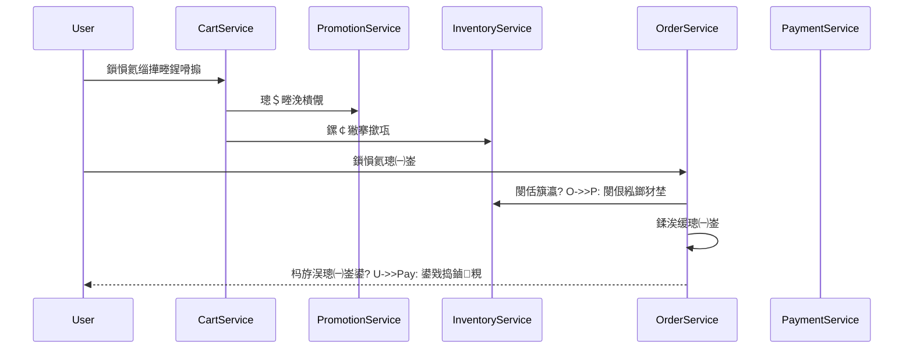
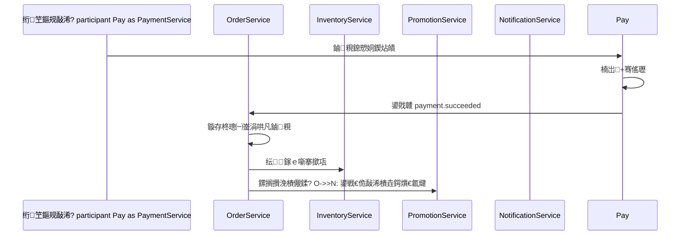

# 鍩轰簬寰湇鍔℃灦鏋勭殑鍦ㄧ嚎鍟嗗煄绯荤粺鍒嗘ā鍧楄缁嗗紑鍙戞枃妗?
## 1. 鏂囨。璇存槑

- 鏂囨。鍚嶇О锛氬湪绾垮晢鍩庡井鏈嶅姟绯荤粺寮€鍙戣璁℃枃妗?- 鏂囨。鐩爣锛氫负鐮斿彂銆佹祴璇曘€佽繍缁淬€佷骇鍝併€侀」鐩鐞嗘彁渚涚粺涓€鐨勭郴缁熷缓璁捐摑鍥?- 閫傜敤鑼冨洿锛歅C 鍟嗗煄銆丠5 鍟嗗煄銆丄pp銆佸皬绋嬪簭銆佽繍钀ョ鐞嗗悗鍙?- 鏋舵瀯椋庢牸锛氬井鏈嶅姟鏋舵瀯
- 榛樿涓氬姟鍋囪锛氫竴鏈熶负鑷惀 B2C 鍟嗗煄锛屾灦鏋勫眰闈㈤鐣欐墿灞曞埌骞冲彴鎷涘晢銆侀棬搴椼€佽嚜鎻愩€佸垎閿€鐨勮兘鍔?- 鎺ㄨ崘鎶€鏈爤锛?  - 鍚庣锛欽ava 17銆丼pring Boot銆丼pring Cloud Alibaba銆丼pring Cloud Gateway銆丱penFeign銆丮yBatis-Plus
  - 娉ㄥ唽閰嶇疆涓績锛歂acos
  - 鏁版嵁搴擄細MySQL 8
  - 缂撳瓨锛歊edis 7
  - 娑堟伅闃熷垪锛歊ocketMQ
  - 鎼滅储锛欵lasticsearch
  - 鏂囦欢瀛樺偍锛歁inIO 鎴栧璞″瓨鍌?OSS
  - 浠诲姟璋冨害锛歑XL-JOB 鎴?Spring Scheduler
  - 鍓嶇锛歏ue3 + Vite + TypeScript锛岀Щ鍔ㄧ鍙€?uni-app
  - 鐩戞帶锛歅rometheus + Grafana + Loki + OpenTelemetry

## 2. 椤圭洰鐩爣涓庤寖鍥?
### 2.1 椤圭洰鐩爣

寤鸿涓€濂楀叿澶囬珮鍙敤銆侀珮鎵╁睍銆佹槗缁存姢鑳藉姏鐨勫湪绾垮晢鍩庡钩鍙帮紝婊¤冻浠ヤ笅鏍稿績涓氬姟璇夋眰锛?
1. 鏀寔鐢ㄦ埛娉ㄥ唽鐧诲綍銆佸晢鍝佹祻瑙堛€佹悳绱€佽喘鐗╄溅銆佷笅鍗曘€佹敮浠樸€佸彂璐с€佽瘎浠枫€佸敭鍚庣瓑瀹屾暣浜ゆ槗闂幆銆?2. 鏀寔鍚庡彴鍟嗗搧銆佸簱瀛樸€佽鍗曘€佽惀閿€銆佸唴瀹广€佺敤鎴枫€佹潈闄愩€佹姤琛ㄧ鐞嗐€?3. 鏀寔楂樺苟鍙戠儹鐐硅闂紝渚嬪澶т績鏈熼棿棣栭〉璁块棶銆佸晢鍝佽鎯呫€佺鏉€鎶㈣喘銆佹敮浠樺洖璋冦€?4. 鏀寔鏈嶅姟鐙珛閮ㄧ讲銆佸脊鎬ф墿瀹广€佺伆搴﹀彂甯冧笌閾捐矾瑙傛祴銆?5. 鏀寔鍚庣画鎵╁睍鍒板鍟嗘埛銆侀棬搴椼€佽嚜鎻愩€佷細鍛樻垚闀裤€佺Н鍒嗗晢鍩庣瓑涓氬姟褰㈡€併€?
### 2.2 涓€鏈熶笟鍔¤寖鍥?
涓€鏈熷缓璁仛鐒︿互涓嬭兘鍔涳細

- 鐢ㄦ埛涓績
- 鍟嗗搧涓績
- 搴撳瓨涓績
- 鎼滅储涓績
- 璐墿杞?- 钀ラ攢涓績
- 璁㈠崟涓績
- 鏀粯涓績
- 鐗╂祦涓績
- 璇勪环涓績
- 鍐呭杩愯惀
- 閫氱煡涓績
- 绠＄悊鍚庡彴
- 鏁版嵁鎶ヨ〃

### 2.3 瑙掕壊瀹氫箟

- 娓稿锛氭祻瑙堥椤点€佸垎绫婚〉銆佸晢鍝佽鎯呴〉銆佹悳绱㈤〉
- 娉ㄥ唽鐢ㄦ埛锛氫笅鍗曘€佹敮浠樸€佹敹璐с€佽瘎浠枫€佺敵璇峰敭鍚?- 杩愯惀浜哄憳锛氱淮鎶ゅ晢鍝併€佸簱瀛樸€佹椿鍔ㄣ€佸唴瀹广€佺敤鎴锋爣绛?- 瀹㈡湇浜哄憳锛氬鐞嗚鍗曟煡璇€侀€€娆俱€佸敭鍚庛€佹姇璇?- 璐㈠姟浜哄憳锛氭牳瀵规敮浠樺崟銆侀€€娆惧崟銆佸璐﹀崟
- 绠＄悊鍛橈細绠＄悊瑙掕壊鏉冮檺銆佺郴缁熼厤缃€佸璁℃棩蹇?
### 2.4 闈炲姛鑳介渶姹?
- 鍙敤鎬х洰鏍囷細鏍稿績浜ゆ槗閾捐矾鍙敤鎬т笉浣庝簬 99.9%
- 鎬ц兘鐩爣锛?  - 鍟嗗搧璇︽儏鎺ュ彛 P99 灏忎簬 500ms
  - 涓嬪崟鎺ュ彛 P99 灏忎簬 800ms
  - 鏀粯鍥炶皟澶勭悊瀹屾垚鏃堕棿灏忎簬 2s
- 鎵╁睍鎬х洰鏍囷細鍗曟湇鍔″彲鐙珛鎵╁锛屼笉渚濊禆鏁翠綋鍙戝竷
- 瀹夊叏鐩爣锛氭敮鎸侀壌鏉冦€佸璁°€侀檺娴併€侀槻閲嶆斁銆侀槻鍒枫€佹晱鎰熸暟鎹劚鏁?- 杩愮淮鐩爣锛氭敮鎸佹棩蹇楄仛鍚堛€侀摼璺拷韪€佹寚鏍囩洃鎺с€佹姤璀﹂€氱煡

## 3. 鎬讳綋鏋舵瀯璁捐

### 3.1 鏋舵瀯鍒嗗眰

绯荤粺寤鸿鍒嗕负浜斿眰锛?
1. 鎺ュ叆灞傦細Web/H5/App/灏忕▼搴?绠＄悊鍚庡彴
2. 缃戝叧灞傦細缁熶竴閴存潈銆佽矾鐢便€侀檺娴併€佺伆搴︺€佽法鍩熴€佹棩蹇?3. 涓氬姟鏈嶅姟灞傦細鐢ㄦ埛銆佸晢鍝併€佽鍗曘€佹敮浠樼瓑鐙珛寰湇鍔?4. 涓棿浠跺眰锛歂acos銆丷edis銆丷ocketMQ銆丒lasticsearch銆佸璞″瓨鍌?5. 鏁版嵁灞傦細鍚勬湇鍔＄嫭绔嬫暟鎹簱銆佹姤琛ㄥ簱銆佹棩蹇楀簱

### 3.2 鎬讳綋閫昏緫鏋舵瀯鍥?
```mermaid
flowchart LR
    A["PC/H5/App/灏忕▼搴?] --> B["API Gateway"]
    C["杩愯惀鍚庡彴"] --> B

    B --> D["璁よ瘉鏈嶅姟"]
    B --> E["鐢ㄦ埛鏈嶅姟"]
    B --> F["鍟嗗搧鏈嶅姟"]
    B --> G["搴撳瓨鏈嶅姟"]
    B --> H["鎼滅储鏈嶅姟"]
    B --> I["璐墿杞︽湇鍔?]
    B --> J["钀ラ攢鏈嶅姟"]
    B --> K["璁㈠崟鏈嶅姟"]
    B --> L["鏀粯鏈嶅姟"]
    B --> M["鐗╂祦鏈嶅姟"]
    B --> N["璇勪环鏈嶅姟"]
    B --> O["鍐呭鏈嶅姟"]
    B --> P["閫氱煡鏈嶅姟"]
    B --> Q["鎶ヨ〃鏈嶅姟"]
    B --> R["鏂囦欢鏈嶅姟"]
    B --> S["绠＄悊鍚庡彴鏈嶅姟"]

    D --> T["Nacos"]
    E --> T
    F --> T
    G --> T
    H --> T
    I --> T
    J --> T
    K --> T
    L --> T
    M --> T
    N --> T
    O --> T
    P --> T
    Q --> T
    R --> T
    S --> T

    E --> U["MySQL"]
    F --> U
    G --> U
    I --> U
    J --> U
    K --> U
    L --> U
    M --> U
    N --> U
    O --> U
    P --> U
    Q --> U
    S --> U

    E --> V["Redis"]
    F --> V
    G --> V
    H --> V
    I --> V
    J --> V
    K --> V
    L --> V
    P --> V

    F --> W["RocketMQ"]
    G --> W
    J --> W
    K --> W
    L --> W
    M --> W
    N --> W
    P --> W
    Q --> W

    F --> X["Elasticsearch"]
    H --> X
    R --> Y["MinIO/OSS"]
```

### 3.3 寰湇鍔℃媶鍒嗗師鍒?
- 鍗曚竴鑱岃矗锛氭瘡涓湇鍔″彧璐熻矗涓€涓浉瀵圭嫭绔嬬殑涓氬姟鍩?- 鏁版嵁鐙珛锛氭瘡涓湇鍔℃嫢鏈夎嚜宸辩殑鏁版嵁搴擄紝閬垮厤璺ㄥ簱鐩存帴鍐欏叆
- 鎺ュ彛娓呮櫚锛氬悓姝ヨ皟鐢ㄧ敤浜庢煡璇㈠拰鐭簨鍔★紝寮傛娑堟伅鐢ㄤ簬鐘舵€佷紶鎾笌鏈€缁堜竴鑷存€?- 鍙崟鐙墿灞曪細鍟嗗搧鎼滅储銆佽鍗曘€佹敮浠樸€佸簱瀛樼瓑鐑偣鏈嶅姟鍙嫭绔嬫墿瀹?- 婕旇繘寮忓缓璁撅細鍥㈤槦瑙勬ā杈冨皬鏃跺彲鍏堥€昏緫鎷嗗垎銆佺墿鐞嗗皯閲忛儴缃诧紝鍚庣画鍐嶆媶缁?
### 3.4 閫氫俊鏂瑰紡

- 澶栭儴璁块棶锛欻TTP/HTTPS + REST API
- 鍐呴儴鍚屾璋冪敤锛歄penFeign
- 鍐呴儴寮傛璋冪敤锛歊ocketMQ 浜嬩欢椹卞姩
- 閰嶇疆涓庡彂鐜帮細Nacos
- 澶ф枃浠惰闂細瀵硅薄瀛樺偍鐩翠紶鎴栭绛惧悕涓婁紶

### 3.5 涓€鑷存€х瓥鐣?
- 寮轰竴鑷村満鏅細鍗曟湇鍔℃湰鍦颁簨鍔?- 璺ㄦ湇鍔′簨鍔★細鏈湴浜嬪姟 + 鍙潬娑堟伅 + 骞傜瓑娑堣垂
- 鍏抽敭涓氬姟寤鸿妯″紡锛?  - 涓嬪崟閿佸簱瀛橈細棰勫崰搴撳瓨
  - 鏀粯鎴愬姛鏇存柊璁㈠崟锛氭敮浠樺洖璋冮┍鍔?  - 璁㈠崟瓒呮椂鍙栨秷锛氬欢杩熸秷鎭?  - 浼樻儬鍒搁攣瀹氫笌閲婃斁锛氱姸鎬佹満 + MQ
- 涓嶅缓璁娇鐢ㄥ叏灞€鍒嗗竷寮?2PC锛岄伩鍏嶇壓鐗叉€ц兘涓庡彲鐢ㄦ€?
## 4. 鏈嶅姟娓呭崟涓庢ā鍧楄竟鐣?
| 鏈嶅姟鍚?| 涓氬姟鍩?| 鏍稿績鑱岃矗 | 鐙珛鏁版嵁搴?|
| --- | --- | --- | --- |
| gateway-service | 缃戝叧鍩?| 璺敱銆侀壌鏉冦€侀檺娴併€佺伆搴︺€佺粺涓€鍝嶅簲 | 鍚?|
| auth-service | 璁よ瘉鍩?| 鐧诲綍銆佹敞鍐屻€佷护鐗屻€佽澶囦細璇濄€侀獙璇佺爜 | mall_auth |
| user-service | 鐢ㄦ埛鍩?| 鐢ㄦ埛璧勬枡銆佸湴鍧€銆佺瓑绾с€佹爣绛俱€佹敹璐т俊鎭?| mall_user |
| product-service | 鍟嗗搧鍩?| SPU/SKU銆佺被鐩€佸搧鐗屻€佸睘鎬с€佷环鏍?| mall_product |
| inventory-service | 搴撳瓨鍩?| 搴撳瓨銆侀攣瀹氬簱瀛樸€佷粨搴撱€佹墸鍑忋€佸洖婊?| mall_inventory |
| search-service | 鎼滅储鍩?| 绱㈠紩鏋勫缓銆佹绱€佹帓搴忋€佽仛鍚堟帹鑽?| mall_search |
| cart-service | 浜ゆ槗鍑嗗鍩?| 璐墿杞︺€侀€変腑鎬併€佸け鏁堟牎楠屻€佷环鏍煎揩鐓?| mall_cart |
| promotion-service | 钀ラ攢鍩?| 浼樻儬鍒搞€佹弧鍑忋€佺鏉€銆佹椿鍔ㄨ鍒欍€佷細鍛樹环 | mall_promotion |
| order-service | 浜ゆ槗鍩?| 涓嬪崟銆佽鍗曠姸鎬佹満銆佽鍗曟媶鍒嗐€佸敭鍚庡叆鍙?| mall_order |
| payment-service | 鏀粯鍩?| 鏀粯鍗曘€佸洖璋冦€侀€€娆惧崟銆佹敮浠樻笭閬撻泦鎴?| mall_payment |
| logistics-service | 灞ョ害鍩?| 鍙戣揣銆佺墿娴佸崟銆佽繍鍗曡建杩广€佺鏀剁姸鎬?| mall_logistics |
| review-service | 浜掑姩鍩?| 璇勪环銆佹檼鍗曘€佽拷璇勩€佹晱鎰熻瘝瀹℃牳 | mall_review |
| content-service | 杩愯惀鍩?| 棣栭〉閰嶇疆銆佷笓棰橀〉銆丅anner銆佹帹鑽愪綅 | mall_content |
| notification-service | 閫氱煡鍩?| 绔欏唴淇°€佺煭淇°€侀偖浠躲€佹帹閫佹ā鏉?| mall_notification |
| file-service | 鏂囦欢鍩?| 鍥剧墖涓婁紶銆佹枃浠剁鐞嗐€佽闂鍚?| mall_file |
| admin-service | 骞冲彴绠＄悊鍩?| RBAC銆佽彍鍗曘€佸瓧鍏搞€佸璁℃棩蹇椼€佺郴缁熼厤缃?| mall_admin |
| report-service | 鏁版嵁鍒嗘瀽鍩?| GMV銆佽浆鍖栫巼銆侀攢鍞帓琛屻€佺敤鎴峰闀挎姤琛?| mall_report |

## 5. 鎺ㄨ崘浠ｇ爜浠撳簱缁撴瀯

```text
mall/
鈹溾攢 docs/
鈹溾攢 deploy/
鈹溾攢 mall-gateway/
鈹溾攢 mall-common/
鈹? 鈹溾攢 common-core/
鈹? 鈹溾攢 common-web/
鈹? 鈹溾攢 common-security/
鈹? 鈹溾攢 common-redis/
鈹? 鈹溾攢 common-mq/
鈹? 鈹溾攢 common-log/
鈹? 鈹斺攢 common-test/
鈹溾攢 mall-api/
鈹? 鈹溾攢 api-auth/
鈹? 鈹溾攢 api-user/
鈹? 鈹溾攢 api-product/
鈹? 鈹溾攢 api-order/
鈹? 鈹斺攢 ...
鈹溾攢 mall-services/
鈹? 鈹溾攢 auth-service/
鈹? 鈹溾攢 user-service/
鈹? 鈹溾攢 product-service/
鈹? 鈹溾攢 inventory-service/
鈹? 鈹溾攢 search-service/
鈹? 鈹溾攢 cart-service/
鈹? 鈹溾攢 promotion-service/
鈹? 鈹溾攢 order-service/
鈹? 鈹溾攢 payment-service/
鈹? 鈹溾攢 logistics-service/
鈹? 鈹溾攢 review-service/
鈹? 鈹溾攢 content-service/
鈹? 鈹溾攢 notification-service/
鈹? 鈹溾攢 file-service/
鈹? 鈹溾攢 admin-service/
鈹? 鈹斺攢 report-service/
```

### 5.1 鍏叡妯″潡鑱岃矗

- `common-core`锛氱粺涓€鏋氫妇銆佸紓甯搞€佽繑鍥炲璞°€佸伐鍏风被銆佸父閲?- `common-web`锛氬叏灞€寮傚父銆佸弬鏁版牎楠屻€佹嫤鎴櫒銆佸垎椤电粍浠?- `common-security`锛欽WT銆佹潈闄愭敞瑙ｃ€佺敤鎴蜂笂涓嬫枃銆佹帴鍙ｇ鍚?- `common-redis`锛氱紦瀛樻ā鏉裤€佸垎甯冨紡閿併€佺紦瀛橀敭瑙勮寖
- `common-mq`锛氭秷鎭彂閫佸皝瑁呫€侀噸璇曠瓥鐣ャ€佸箓绛夋秷璐圭粍浠?- `common-log`锛氭棩蹇楄拷韪€乀raceId銆佸璁℃棩蹇楃粺涓€瑙勮寖
- `common-test`锛氭祴璇曞熀绫汇€丮ock 宸ュ叿銆佸绾︽祴璇曟敮鎸?
## 6. 璇︾粏妯″潡璁捐

浠ヤ笅璁捐閲囩敤缁熶竴璇存槑缁撴瀯锛?
- 鑱岃矗鑼冨洿
- 鏍稿績鏁版嵁琛?- 鍏抽敭鎺ュ彛
- 鍏抽敭娑堟伅浜嬩欢
- 鍏抽敭涓氬姟瑙勫垯
- 寮€鍙戦噸鐐?
### 6.1 gateway-service

#### 鑱岃矗鑼冨洿

- 缁熶竴 API 鍏ュ彛
- JWT 鏍￠獙鍜岀敤鎴蜂笂涓嬫枃閫忎紶
- 鐧藉悕鍗曟帴鍙ｆ斁琛?- 闄愭祦銆侀槻鍒枫€侀槻閲嶆斁
- 璺敱杞彂銆佺伆搴﹀彂甯冦€佺粺涓€閿欒鐮?
#### 鍏抽敭鍔熻兘

- 璺敱瑙勫垯閰嶇疆鍖栵紝浣跨敤 Nacos 鍔ㄦ€佷笅鍙?- 鍩轰簬 IP銆佺敤鎴?ID銆佹帴鍙ｇ淮搴﹂檺娴?- 绠＄悊绔笌鐢ㄦ埛绔矾鐢卞垎缁?- 鍏ㄩ摼璺?TraceId 娉ㄥ叆

#### 寮€鍙戦噸鐐?
- 缃戝叧浠呭仛杞婚€昏緫锛屼笉鎵胯浇澶嶆潅涓氬姟
- 鐢ㄦ埛淇℃伅閫忎紶浣跨敤璇锋眰澶达紝閬垮厤缃戝叧鐩存帴鏌ュ簱
- 闄愭祦澶辫触銆侀壌鏉冨け璐ュ搷搴旀牸寮忕粺涓€

### 6.2 auth-service

#### 鑱岃矗鑼冨洿

- 鐢ㄦ埛娉ㄥ唽
- 璐﹀彿瀵嗙爜鐧诲綍
- 鐭俊楠岃瘉鐮佺櫥褰?- 鍒锋柊浠ょ墝
- 鐧诲嚭
- 璁惧浼氳瘽绠＄悊

#### 鏍稿績鏁版嵁琛?
1. `auth_account`
   - `id`
   - `user_id`
   - `login_type`
   - `login_name`
   - `password_hash`
   - `status`
   - `last_login_time`
2. `auth_token_session`
   - `id`
   - `user_id`
   - `access_token`
   - `refresh_token`
   - `device_type`
   - `device_id`
   - `expire_time`
3. `auth_verify_code`
   - `id`
   - `mobile`
   - `scene`
   - `code`
   - `status`
   - `expire_time`

#### 鍏抽敭鎺ュ彛

- `POST /auth/register`
- `POST /auth/login/password`
- `POST /auth/login/mobile`
- `POST /auth/token/refresh`
- `POST /auth/logout`
- `GET /auth/session/list`

#### 鍏抽敭娑堟伅浜嬩欢

- `user.registered`
- `user.login.succeeded`
- `user.login.failed`

#### 鍏抽敭涓氬姟瑙勫垯

- 瀵嗙爜浣跨敤 BCrypt 鎴?Argon2 鍔犲瘑瀛樺偍
- 楠岃瘉鐮侀渶闄愬埗鍙戦€侀鐜囧拰鍚屾墜鏈哄彿鏃ュ彂閫佹鏁?- 鍒锋柊浠ょ墝寤鸿瀛?Redis + MySQL 鍙屽眰鎺у埗
- 鏀寔鍗曡澶囩櫥褰曟垨澶氳澶囩櫥褰曠瓥鐣ラ厤缃?
#### 寮€鍙戦噸鐐?
- 楠岃瘉鐮佹帴鍙ｅ繀椤诲姞鍏ュ浘褰㈤獙璇佺爜銆侀槻鍒枫€侀粦鍚嶅崟
- Token 璁捐寤鸿閲囩敤鐭湡 AccessToken + 闀挎湡 RefreshToken
- 鐧诲綍澶辫触娆℃暟瓒呰繃闃堝€煎悗瑙﹀彂椋庢帶

### 6.3 user-service

#### 鑱岃矗鑼冨洿

- 鐢ㄦ埛璧勬枡绠＄悊
- 鏀惰揣鍦板潃绠＄悊
- 鐢ㄦ埛绛夌骇涓庢垚闀垮€?- 鐢ㄦ埛鏍囩銆侀粦鍚嶅崟鐘舵€?- 瀹炲悕淇℃伅涓庡亸濂借缃?
#### 鏍稿績鏁版嵁琛?
1. `user_info`
   - `id`
   - `nickname`
   - `mobile`
   - `avatar`
   - `gender`
   - `birthday`
   - `level_id`
   - `growth_value`
   - `status`
2. `user_address`
   - `id`
   - `user_id`
   - `consignee_name`
   - `consignee_mobile`
   - `province`
   - `city`
   - `district`
   - `detail_address`
   - `is_default`
3. `user_level`
   - `id`
   - `level_name`
   - `min_growth`
   - `discount_rate`
   - `benefit_desc`

#### 鍏抽敭鎺ュ彛

- `GET /users/me`
- `PUT /users/me/profile`
- `GET /users/addresses`
- `POST /users/addresses`
- `PUT /users/addresses/{id}`
- `DELETE /users/addresses/{id}`
- `GET /users/levels`

#### 鍏抽敭娑堟伅浜嬩欢

- `user.profile.updated`
- `user.level.changed`

#### 鍏抽敭涓氬姟瑙勫垯

- 姣忎釜鐢ㄦ埛鏈€澶氱淮鎶?20 涓湴鍧€
- 榛樿鍦板潃鍞竴
- 鐢ㄦ埛鐘舵€佸垎涓烘甯搞€佸喕缁撱€佹敞閿€涓€佸凡娉ㄩ攢

#### 寮€鍙戦噸鐐?
- 鍦板潃淇℃伅寤鸿浣跨敤鐪佸競鍖虹紪鐮佽〃缁熶竴绠＄悊
- 娑夊強涓汉鏁忔劅淇℃伅鏃堕渶瑕佽劚鏁忓睍绀哄拰鎿嶄綔瀹¤

### 6.4 product-service

#### 鑱岃矗鑼冨洿

- 鍟嗗搧绫荤洰銆佸搧鐗屻€佸睘鎬х鐞?- SPU/SKU 绠＄悊
- 涓婁笅鏋剁鐞?- 鍟嗗搧璇︽儏鑱氬悎
- 浠锋牸绠＄悊

#### 鏍稿績鏁版嵁琛?
1. `product_category`
   - `id`
   - `parent_id`
   - `name`
   - `level`
   - `sort`
   - `status`
2. `product_brand`
   - `id`
   - `name`
   - `logo`
   - `status`
3. `product_spu`
   - `id`
   - `category_id`
   - `brand_id`
   - `title`
   - `sub_title`
   - `main_image`
   - `status`
   - `audit_status`
4. `product_sku`
   - `id`
   - `spu_id`
   - `sku_code`
   - `sku_name`
   - `sale_price`
   - `market_price`
   - `cost_price`
   - `weight`
   - `status`
5. `product_attr`
   - `id`
   - `category_id`
   - `attr_name`
   - `attr_type`
   - `is_searchable`

#### 鍏抽敭鎺ュ彛

- `GET /products/categories/tree`
- `POST /products/spu`
- `PUT /products/spu/{id}`
- `POST /products/spu/{id}/publish`
- `POST /products/spu/{id}/unpublish`
- `GET /products/spu/{id}`
- `GET /products/sku/{id}`
- `GET /products/sku/batch`

#### 鍏抽敭娑堟伅浜嬩欢

- `product.created`
- `product.updated`
- `product.published`
- `product.unpublished`
- `product.price.changed`

#### 鍏抽敭涓氬姟瑙勫垯

- 鍟嗗搧璇︽儏灞曠ず鏁版嵁寤鸿浠ヨ妯″瀷鑱氬悎锛屼笉鍦ㄦ瘡娆¤姹傛椂澶ч噺璺ㄦ湇鍔℃嫾瑁?- 鍟嗗搧涓婁笅鏋跺簲鍚屾鎼滅储绱㈠紩銆佺紦瀛樺拰鎺ㄨ崘浣?- SKU 鏄氦鏄撴渶灏忓崟鍏冿紝璁㈠崟銆佸簱瀛樸€佽喘鐗╄溅鍧囦互 SKU 涓哄噯

#### 寮€鍙戦噸鐐?
- 鍟嗗搧鍙戝竷鍔ㄤ綔闇€瑕佹牎楠屽浘鐗囥€佷环鏍笺€佸簱瀛樸€佸睘鎬ф槸鍚﹀畬鏁?- 鍟嗗搧璇︽儏寤鸿閲囩敤澶氱骇缂撳瓨锛氭湰鍦扮紦瀛?+ Redis + DB
- 鍚庡彴缂栬緫鍜屽墠鍙板睍绀哄瓧娈佃鍒嗗眰锛岄伩鍏嶆妸绠＄悊瀛楁鐩存帴鏆撮湶缁欏墠绔?
### 6.5 inventory-service

#### 鑱岃矗鑼冨洿

- 浠撳簱绠＄悊
- 瀹炴椂搴撳瓨绠＄悊
- 閿佸簱瀛樸€佹墸搴撳瓨銆佸洖婊氬簱瀛?- 搴撳瓨娴佹按璁板綍
- 搴撳瓨棰勮

#### 鏍稿績鏁版嵁琛?
1. `inventory_warehouse`
   - `id`
   - `warehouse_name`
   - `warehouse_code`
   - `contact_name`
   - `contact_mobile`
   - `address`
2. `inventory_stock`
   - `id`
   - `sku_id`
   - `warehouse_id`
   - `available_qty`
   - `locked_qty`
   - `saleable_qty`
   - `version`
3. `inventory_reservation`
   - `id`
   - `order_no`
   - `sku_id`
   - `warehouse_id`
   - `reserve_qty`
   - `status`
   - `expire_time`
4. `inventory_record`
   - `id`
   - `biz_type`
   - `biz_no`
   - `sku_id`
   - `change_qty`
   - `before_qty`
   - `after_qty`

#### 鍏抽敭鎺ュ彛

- `GET /inventory/stock/{skuId}`
- `POST /inventory/reserve`
- `POST /inventory/confirm-deduct`
- `POST /inventory/release`
- `POST /inventory/adjust`

#### 鍏抽敭娑堟伅浜嬩欢

- `inventory.reserved`
- `inventory.reserve.failed`
- `inventory.released`
- `inventory.deducted`
- `inventory.low.warning`

#### 鍏抽敭涓氬姟瑙勫垯

- 涓嬪崟鏃跺彧閿佸簱瀛橈紝涓嶇珛鍗虫墸鍑?- 鏀粯鎴愬姛鎴栬鍗曠‘璁ゅ悗鍐嶆寮忔墸鍑?- 鏈敮浠樿鍗曞彇娑堟椂閲婃斁閿佸簱瀛?- 搴撳瓨鎵ｅ噺蹇呴』骞傜瓑锛屾寜 `order_no + sku_id` 淇濊瘉鍞竴

#### 寮€鍙戦噸鐐?
- 楂樺苟鍙戜笅寤鸿閲囩敤涔愯閿佺増鏈彿鎴栨暟鎹簱鏉′欢鏇存柊
- 绉掓潃鍦烘櫙鍙紩鍏?Redis 棰勫噺搴撳瓨锛屽啀寮傛钀藉簱
- 搴撳瓨鏈嶅姟蹇呴』鏈夋竻鏅扮殑娴佹按璐︼紝渚夸簬瀵硅处鍜岃拷鏌?
### 6.6 search-service

#### 鑱岃矗鑼冨洿

- 鎼滅储绱㈠紩鏋勫缓鍜屾洿鏂?- 鍏抽敭璇嶆悳绱€佺瓫閫夈€佹帓搴忋€佽仛鍚?- 鎼滅储鎺ㄨ崘璇嶃€佽仈鎯宠瘝
- 鐑悳缁熻

#### 鏍稿績鏁版嵁缁撴瀯

- `product_index`
  - `skuId`
  - `spuId`
  - `title`
  - `subTitle`
  - `categoryPath`
  - `brandName`
  - `salePrice`
  - `saleCount`
  - `stockStatus`
  - `attrs`
  - `shopTags`

#### 鍏抽敭鎺ュ彛

- `GET /search/products`
- `GET /search/suggest`
- `GET /search/hot-words`
- `POST /search/index/rebuild`

#### 鍏抽敭娑堟伅浜嬩欢

- 璁㈤槄 `product.published`
- 璁㈤槄 `product.updated`
- 璁㈤槄 `product.unpublished`
- 璁㈤槄 `inventory.deducted`

#### 鍏抽敭涓氬姟瑙勫垯

- 鎼滅储绱㈠紩涓嶆槸涓绘暟鎹簮锛屼互鍟嗗搧鏈嶅姟涓哄噯
- 鎼滅储缁撴灉鍒嗛〉鍜岃仛鍚堣鍏奸【鎬ц兘锛屼笉瀹滆繑鍥炶繃娣卞眰绾?- 鎼滅储缂撳瓨閲嶇偣鏀惧湪鐑棬鍏抽敭璇嶃€佺被鐩〉鍜岀瓫閫夌粨鏋?
#### 寮€鍙戦噸鐐?
- 鏋勫缓绱㈠紩鏃惰鏄惧紡鍖哄垎鍙悳绱㈠瓧娈点€佸彲鑱氬悎瀛楁銆佸睍绀哄瓧娈?- 澶т績鏈熼棿寤鸿瀵圭儹鐐瑰晢鍝佸拰鍏抽敭璇嶅仛缂撳瓨淇濇姢

### 6.7 cart-service

#### 鑱岃矗鑼冨洿

- 璐墿杞﹀晢鍝佸鍒犳敼鏌?- 鍟嗗搧閫変腑鎬佺淮鎶?- 澶辨晥鍟嗗搧璇嗗埆
- 缁撶畻鍓嶄环鏍间笌搴撳瓨鏍￠獙

#### 鏍稿績鏁版嵁琛?
1. `cart_item`
   - `id`
   - `user_id`
   - `sku_id`
   - `sku_name`
   - `sale_price_snapshot`
   - `quantity`
   - `checked`
   - `status`
   - `source_type`

#### 鍏抽敭鎺ュ彛

- `GET /cart/items`
- `POST /cart/items`
- `PUT /cart/items/{skuId}`
- `DELETE /cart/items/{skuId}`
- `POST /cart/check`
- `POST /cart/settlement/preview`

#### 鍏抽敭娑堟伅浜嬩欢

- `cart.checked.out`
- `product.price.changed` 璁㈤槄鍚庡埛鏂颁环鏍煎揩鐓?- `product.unpublished` 璁㈤槄鍚庢爣璁板け鏁?
#### 鍏抽敭涓氬姟瑙勫垯

- 璐墿杞︽暟鎹缓璁紭鍏堟斁 Redis锛屽畾鏃惰惤搴撴垨鐢ㄦ埛鎿嶄綔鏃跺悓姝?DB
- 杩涘叆缁撶畻椤靛繀椤婚噸鏂版牎楠屼环鏍笺€佸簱瀛樸€佹椿鍔ㄨ祫鏍?- 鍚屼竴鐢ㄦ埛鍚屼竴 SKU 鍦ㄨ喘鐗╄溅涓敮涓€

#### 寮€鍙戦噸鐐?
- 鏈櫥褰曠敤鎴疯喘鐗╄溅鍙熀浜庤澶?ID 鎴栨祻瑙堝櫒鏈湴缂撳瓨
- 鐧诲綍鍚庨渶鏀寔鍖垮悕璐墿杞﹀悎骞?
### 6.8 promotion-service

#### 鑱岃矗鑼冨洿

- 浼樻儬鍒?- 婊″噺婊℃姌
- 鍗曞搧鎶樻墸
- 闄愭椂绉掓潃
- 浼氬憳浠枫€侀樁姊环

#### 鏍稿績鏁版嵁琛?
1. `promotion_activity`
   - `id`
   - `activity_type`
   - `activity_name`
   - `start_time`
   - `end_time`
   - `status`
2. `coupon_template`
   - `id`
   - `coupon_name`
   - `coupon_type`
   - `threshold_amount`
   - `discount_amount`
   - `total_count`
   - `per_limit`
   - `valid_type`
3. `coupon_user`
   - `id`
   - `user_id`
   - `template_id`
   - `coupon_code`
   - `status`
   - `lock_order_no`
   - `used_order_no`
4. `flash_sale_sku`
   - `id`
   - `activity_id`
   - `sku_id`
   - `flash_price`
   - `limit_per_user`
   - `stock_quota`

#### 鍏抽敭鎺ュ彛

- `GET /promotions/product/{skuId}`
- `POST /promotions/coupons/receive`
- `POST /promotions/coupons/lock`
- `POST /promotions/coupons/release`
- `POST /promotions/coupons/use`
- `POST /promotions/settlement/calculate`

#### 鍏抽敭娑堟伅浜嬩欢

- `coupon.locked`
- `coupon.released`
- `coupon.used`
- `order.cancelled` 璁㈤槄鍚庨噴鏀惧埜
- `payment.succeeded` 璁㈤槄鍚庢牳閿€鍒?
#### 鍏抽敭涓氬姟瑙勫垯

- 钀ラ攢璁＄畻蹇呴』鏈夌粺涓€瑙勫垯寮曟搸锛岄伩鍏嶅悇鏈嶅姟閲嶅瀹炵幇
- 浼樻儬鍒稿湪鎻愪氦璁㈠崟鏃跺厛閿佸畾锛屽湪鏀粯鎴愬姛鍚庢牳閿€
- 涓嶅悓钀ラ攢瑙勫垯闇€瑕佸畾涔変紭鍏堢骇鍜屾槸鍚﹀彔鍔?
#### 寮€鍙戦噸鐐?
- 绉掓潃娲诲姩瑕佽€冭檻鐢ㄦ埛闄愯喘銆佸簱瀛橀殧绂汇€佹帓闃熷墛宄?- 缁撶畻鏃跺簲杩斿洖鏄庣粏锛氬師浠枫€佷紭鎯犻噾棰濄€佽繍璐广€佸疄浠橀噾棰濄€佸懡涓殑娲诲姩鍒楄〃

### 6.9 order-service

#### 鑱岃矗鑼冨洿

- 璁㈠崟鍒涘缓
- 璁㈠崟鐘舵€佹祦杞?- 璁㈠崟鏄庣粏
- 璁㈠崟鍙栨秷銆佺‘璁ゆ敹璐?- 鍞悗鐢宠鍏ュ彛

#### 鏍稿績鏁版嵁琛?
1. `order_info`
   - `id`
   - `order_no`
   - `user_id`
   - `order_status`
   - `total_amount`
   - `discount_amount`
   - `freight_amount`
   - `pay_amount`
   - `pay_status`
   - `source_type`
   - `remark`
2. `order_item`
   - `id`
   - `order_no`
   - `sku_id`
   - `spu_id`
   - `sku_name`
   - `buy_price`
   - `buy_quantity`
   - `item_amount`
3. `order_operate_log`
   - `id`
   - `order_no`
   - `before_status`
   - `after_status`
   - `operate_type`
   - `operator_id`
4. `order_after_sale`
   - `id`
   - `after_sale_no`
   - `order_no`
   - `order_item_id`
   - `after_sale_type`
   - `reason_code`
   - `refund_amount`
   - `status`

#### 鍏抽敭鎺ュ彛

- `POST /orders/submit`
- `POST /orders/{orderNo}/cancel`
- `GET /orders/{orderNo}`
- `GET /orders`
- `POST /orders/{orderNo}/confirm-receipt`
- `POST /orders/{orderNo}/after-sale/apply`

#### 鍏抽敭娑堟伅浜嬩欢

- `order.created`
- `order.cancelled`
- `order.timeout.cancelled`
- `order.paid`
- `order.shipped`
- `order.finished`

#### 鍏抽敭涓氬姟瑙勫垯

- 涓嬪崟娴佺▼锛?  1. 鏍￠獙鐢ㄦ埛涓庡湴鍧€
  2. 鎷夊彇璐墿杞﹂€変腑鍟嗗搧
  3. 鏍￠獙浠锋牸銆佸簱瀛樸€佹椿鍔ㄨ祫鏍?  4. 閿佸簱瀛?  5. 閿佷紭鎯犲埜
  6. 鍒涘缓璁㈠崟
  7. 鍙戦€佸欢杩熷叧闂秷鎭?- 璁㈠崟鍙峰繀椤诲叏灞€鍞竴锛屽彲閲囩敤闆姳绠楁硶鎴栧彿娈垫ā寮?- 璁㈠崟鍒涘缓鎴愬姛鍚庯紝涓嶅厑璁稿啀娆￠噸澶嶆彁浜わ紝鍙娇鐢ㄩ槻閲嶅 token

#### 寮€鍙戦噸鐐?
- 璁㈠崟鏈嶅姟鏄氦鏄撴牳蹇冿紝鐘舵€佹満蹇呴』娓呮櫚鍙拷韪?- 寤鸿瀵硅鍗曟煡璇㈡瀯寤鸿妯″瀷锛岄伩鍏嶆槑缁嗚仈琛ㄨ繃娣?- 鍞悗娴佺▼寤鸿浣滀负璁㈠崟鍩熷瓙妯″潡鎴栧悗缁嫭绔嬫湇鍔℃紨杩?
### 6.10 payment-service

#### 鑱岃矗鑼冨洿

- 鏀粯鍗曞垱寤?- 瀵规帴绗笁鏂规敮浠樻笭閬?- 鏀粯缁撴灉鍥炶皟
- 閫€娆惧崟澶勭悊
- 瀵硅处鏂囦欢涓嬭浇涓庢牳瀵?
#### 鏍稿績鏁版嵁琛?
1. `payment_order`
   - `id`
   - `payment_no`
   - `order_no`
   - `user_id`
   - `pay_channel`
   - `pay_amount`
   - `pay_status`
   - `third_trade_no`
2. `payment_notify_log`
   - `id`
   - `payment_no`
   - `notify_type`
   - `notify_content`
   - `process_status`
3. `refund_order`
   - `id`
   - `refund_no`
   - `order_no`
   - `payment_no`
   - `refund_amount`
   - `refund_status`
   - `reason`

#### 鍏抽敭鎺ュ彛

- `POST /payments/create`
- `POST /payments/notify/{channel}`
- `GET /payments/{paymentNo}`
- `POST /payments/refund`
- `GET /payments/reconcile`

#### 鍏抽敭娑堟伅浜嬩欢

- `payment.created`
- `payment.succeeded`
- `payment.failed`
- `refund.succeeded`
- `refund.failed`

#### 鍏抽敭涓氬姟瑙勫垯

- 鏀粯鍥炶皟蹇呴』楠岀骞跺箓绛夊鐞?- 鍙湁璁㈠崟鐘舵€佷负寰呮敮浠樻椂鍏佽鍙戣捣鏀粯
- 鍚屼竴璁㈠崟鍦ㄤ换鎰忔椂鍒讳粎鍏佽涓€涓湁鏁堟敮浠樺崟
- 閫€娆惧崟蹇呴』璁板綍鍘熸敮浠樺崟鍜岄€€娆炬祦姘村彿

#### 寮€鍙戦噸鐐?
- 绗笁鏂瑰洖璋冨鐞嗗繀椤诲厛钀芥棩蹇楀啀鎵ц涓氬姟
- 瀵硅处浠诲姟姣忓ぉ鑷冲皯鎵ц涓€娆★紝鍙戠幇宸紓鑷姩鍛婅
- 鏀粯鏁忔劅鍙傛暟涓嶅緱钀芥櫘閫氭棩蹇?
### 6.11 logistics-service

#### 鑱岃矗鑼冨洿

- 鍙戣揣鍗曠鐞?- 杩愬崟鍙风淮鎶?- 鐗╂祦杞ㄨ抗鍚屾
- 鐢ㄦ埛鏀惰揣鐘舵€佹帹杩?
#### 鏍稿績鏁版嵁琛?
1. `shipment_order`
   - `id`
   - `shipment_no`
   - `order_no`
   - `warehouse_id`
   - `express_company_code`
   - `express_no`
   - `shipment_status`
2. `shipment_item`
   - `id`
   - `shipment_no`
   - `order_item_id`
   - `sku_id`
   - `quantity`
3. `shipment_track`
   - `id`
   - `shipment_no`
   - `track_time`
   - `track_status`
   - `track_content`

#### 鍏抽敭鎺ュ彛

- `POST /logistics/shipments/create`
- `POST /logistics/shipments/{shipmentNo}/deliver`
- `GET /logistics/shipments/{shipmentNo}/tracks`
- `POST /logistics/shipments/sync-tracks`

#### 鍏抽敭娑堟伅浜嬩欢

- `order.paid` 璁㈤槄鍚庡噯澶囧饱绾?- `order.shipped`
- `shipment.delivered`

#### 鍏抽敭涓氬姟瑙勫垯

- 鏀寔涓€鍗曞鍖呰９
- 鏀寔閮ㄥ垎鍙戣揣
- 绛炬敹鎴愬姛鍚庢帹鍔ㄨ鍗曡繘鍏ュ緟瀹屾垚鎴栧凡瀹屾垚鐘舵€?
#### 寮€鍙戦噸鐐?
- 鐗╂祦鐘舵€佸彲鑳芥潵鑷涓夋柟杞鍜屽洖璋冧袱绉嶆ā寮?- 杞ㄨ抗鏇存柊瑕佹湁鍘婚噸绛栫暐

### 6.12 review-service

#### 鑱岃矗鑼冨洿

- 鍟嗗搧璇勪环
- 鍥剧墖鏅掑崟
- 杩借瘎
- 瀹℃牳鍜屾晱鎰熻瘝杩囨护

#### 鏍稿績鏁版嵁琛?
1. `review_info`
   - `id`
   - `order_no`
   - `order_item_id`
   - `user_id`
   - `sku_id`
   - `score`
   - `content`
   - `status`
2. `review_image`
   - `id`
   - `review_id`
   - `image_url`
   - `sort`
3. `review_reply`
   - `id`
   - `review_id`
   - `reply_type`
   - `content`

#### 鍏抽敭鎺ュ彛

- `POST /reviews`
- `GET /reviews/product/{skuId}`
- `POST /reviews/{id}/append`
- `POST /reviews/{id}/audit`

#### 鍏抽敭娑堟伅浜嬩欢

- `order.finished` 璁㈤槄鍚庡紑鏀捐瘎浠疯祫鏍?- `review.created`
- `review.audited`

#### 鍏抽敭涓氬姟瑙勫垯

- 浠呭凡瀹屾垚璁㈠崟鍙瘎浠?- 姣忎釜璁㈠崟椤归粯璁や粎鍏佽璇勪环涓€娆★紝鍙拷鍔犺拷璇?- 璇勪环鍙戝竷鍓嶅彲閫夋嫨浜哄伐瀹℃牳鎴栨満瀹?
#### 寮€鍙戦噸鐐?
- 璇勪环鍐呭娑夊強瀹℃牳涓庨鎺э紝寤鸿淇濈暀鏈哄櫒瀹℃牳缁撴灉鍜屼汉宸ュ鐞嗚褰?
### 6.13 content-service

#### 鑱岃矗鑼冨洿

- 棣栭〉 Banner
- 妤煎眰閰嶇疆
- 涓撻娲诲姩椤?- 鍏憡鍜屽府鍔╀腑蹇?
#### 鏍稿績鏁版嵁琛?
1. `content_banner`
   - `id`
   - `title`
   - `image_url`
   - `jump_type`
   - `jump_target`
   - `sort`
   - `status`
2. `content_topic`
   - `id`
   - `topic_name`
   - `cover_image`
   - `content_json`
   - `status`
3. `content_notice`
   - `id`
   - `title`
   - `content`
   - `publish_time`
   - `status`

#### 鍏抽敭鎺ュ彛

- `GET /contents/home`
- `GET /contents/banners`
- `GET /contents/topics/{id}`
- `POST /admin/contents/banners`

#### 寮€鍙戦噸鐐?
- 鍐呭鏈嶅姟閫傚悎鍓嶅悗鍙板垎鎺ュ彛璁捐
- 棣栭〉閰嶇疆寤鸿浠?JSON 妯℃澘瀛樺偍锛屽噺灏戦绻佹敼琛?
### 6.14 notification-service

#### 鑱岃矗鑼冨洿

- 鐭俊閫氱煡
- 閭欢閫氱煡
- 绔欏唴淇?- App Push
- 娑堟伅妯℃澘绠＄悊

#### 鏍稿績鏁版嵁琛?
1. `notify_template`
   - `id`
   - `template_code`
   - `channel_type`
   - `template_content`
   - `status`
2. `notify_message`
   - `id`
   - `biz_type`
   - `biz_no`
   - `receiver`
   - `channel_type`
   - `send_status`
   - `retry_count`
3. `notify_inbox`
   - `id`
   - `user_id`
   - `title`
   - `content`
   - `read_status`

#### 鍏抽敭鎺ュ彛

- `POST /notifications/send`
- `GET /notifications/inbox`
- `POST /notifications/inbox/{id}/read`

#### 鍏抽敭娑堟伅浜嬩欢

- 璁㈤槄 `order.created`
- 璁㈤槄 `payment.succeeded`
- 璁㈤槄 `shipment.delivered`
- 璁㈤槄 `refund.succeeded`

#### 寮€鍙戦噸鐐?
- 娑堟伅鍙戦€佽鏀寔澶辫触閲嶈瘯鍜屾淇″鐞?- 妯℃澘鍙橀噺娓叉煋蹇呴』鏈夋牎楠岋紝閬垮厤绌哄彉閲忓鑷村彂閫佸け璐?
### 6.15 file-service

#### 鑱岃矗鑼冨洿

- 鍥剧墖涓婁紶
- 鏂囦欢鍏冩暟鎹鐞?- 鏂囦欢璁块棶绛惧悕
- 濯掍綋璧勬簮鍒嗙被

#### 鏍稿績鏁版嵁琛?
1. `file_object`
   - `id`
   - `biz_type`
   - `object_name`
   - `original_name`
   - `bucket`
   - `url`
   - `content_type`
   - `file_size`

#### 鍏抽敭鎺ュ彛

- `POST /files/upload`
- `POST /files/upload/presign`
- `GET /files/{id}`
- `DELETE /files/{id}`

#### 寮€鍙戦噸鐐?
- 鍓嶇涓婁紶寤鸿閲囩敤棰勭鍚嶇洿浼狅紝鍚庣鍙瓨鍏冩暟鎹?- 鍟嗗搧鍥俱€佽瘎浠峰浘銆丅anner 鍥惧缓璁寜涓氬姟鐩綍瀛樺偍

### 6.16 admin-service

#### 鑱岃矗鑼冨洿

- 鍚庡彴绠＄悊鍛樼櫥褰?- 瑙掕壊鏉冮檺绠＄悊
- 鑿滃崟绠＄悊
- 瀛楀吀閰嶇疆
- 鎿嶄綔鏃ュ織
- 鍙傛暟閰嶇疆

#### 鏍稿績鏁版嵁琛?
1. `admin_user`
   - `id`
   - `username`
   - `password_hash`
   - `status`
2. `admin_role`
   - `id`
   - `role_name`
   - `role_code`
   - `status`
3. `admin_menu`
   - `id`
   - `parent_id`
   - `menu_name`
   - `path`
   - `permission_code`
4. `admin_user_role`
   - `user_id`
   - `role_id`
5. `admin_role_menu`
   - `role_id`
   - `menu_id`
6. `admin_operate_log`
   - `id`
   - `operator_id`
   - `module_name`
   - `request_uri`
   - `request_method`
   - `request_params`
   - `result_code`

#### 鍏抽敭鎺ュ彛

- `POST /admin/auth/login`
- `GET /admin/users/me`
- `GET /admin/menus/tree`
- `POST /admin/roles`
- `POST /admin/permissions/assign`

#### 寮€鍙戦噸鐐?
- 鍚庡彴鏉冮檺寤鸿缁嗗寲鍒版寜閽骇缂栫爜
- 楂橀闄╂搷浣滃閫€娆俱€佹墜宸ユ敼浠枫€佸簱瀛樿皟鏁村繀椤诲璁?
### 6.17 report-service

#### 鑱岃矗鑼冨洿

- 浜ゆ槗鎶ヨ〃
- 鐢ㄦ埛澧為暱鎶ヨ〃
- 鍟嗗搧閿€鍞垎鏋?- 娓犻亾杞寲鍒嗘瀽
- 澶у睆鏁版嵁杈撳嚭

#### 鏁版嵁鏉ユ簮

- 璁㈠崟鏈嶅姟锛欸MV銆佽鍗曢噺銆侀€€娆鹃
- 鐢ㄦ埛鏈嶅姟锛氭柊澧炵敤鎴枫€佹椿璺冪敤鎴枫€佷細鍛樼瓑绾у垎甯?- 鍟嗗搧鏈嶅姟锛氬晢鍝佹祻瑙堛€佽浆鍖栫巼銆佹粸閿€鎺掕
- 鏀粯鏈嶅姟锛氭敮浠樻垚鍔熺巼銆佹笭閬撳崰姣?
#### 鏍稿績鏁版嵁琛?
1. `report_trade_daily`
   - `stat_date`
   - `order_count`
   - `paid_order_count`
   - `gmv_amount`
   - `refund_amount`
2. `report_user_daily`
   - `stat_date`
   - `new_user_count`
   - `active_user_count`
   - `pay_user_count`

#### 鍏抽敭鎺ュ彛

- `GET /reports/trade/overview`
- `GET /reports/users/overview`
- `GET /reports/products/top-sales`

#### 寮€鍙戦噸鐐?
- 鎶ヨ〃鏈嶅姟灏介噺浣跨敤绂荤嚎姹囨€昏〃锛屼笉鐩存帴鍘嬩富涓氬姟搴?- 寤鸿閫氳繃 MQ 璁㈤槄浜嬩欢澧為噺鏇存柊鎸囨爣

## 7. 鏍稿績涓氬姟娴佺▼璁捐

### 7.1 鐢ㄦ埛涓嬪崟娴佺▼



#### 鍏抽敭鎺у埗鐐?
- 鎻愪氦璁㈠崟鍓嶅繀椤讳簩娆℃牎楠屼环鏍笺€佹椿鍔ㄣ€佸簱瀛?- 閿佸簱瀛樻垚鍔熶絾璁㈠崟鍒涘缓澶辫触鏃讹紝瑕佸彂閫侀噴鏀惧簱瀛樻秷鎭?- 璁㈠崟鍒涘缓鎴愬姛鍚庡彂閫佸欢杩熸秷鎭紝瓒呮椂鏈敮浠樿嚜鍔ㄥ叧闂?
### 7.2 鏀粯鎴愬姛娴佺▼



### 7.3 璁㈠崟瓒呮椂鍏抽棴娴佺▼

- 璁㈠崟鍒涘缓鍚庡彂閫佸欢杩熸秷鎭?`order.close.delay`
- 鍒拌揪瓒呮椂鏃堕棿鍚庣敱璁㈠崟鏈嶅姟妫€鏌ヨ鍗曠姸鎬?- 鑻ヤ粛涓哄緟鏀粯锛屽垯鍏抽棴璁㈠崟
- 鍏抽棴璁㈠崟鍚庡彂甯?`order.cancelled`
- 搴撳瓨鏈嶅姟閲婃斁閿佸簱瀛?- 钀ラ攢鏈嶅姟閲婃斁閿佸畾浼樻儬鍒?
### 7.4 鍞悗閫€娆炬祦绋?
1. 鐢ㄦ埛鎻愪氦閫€娆剧敵璇?2. 璁㈠崟鏈嶅姟鐢熸垚鍞悗鍗?3. 瀹㈡湇瀹℃牳閫氳繃鍚庤皟鐢ㄦ敮浠樻湇鍔″彂璧烽€€娆?4. 鏀粯鏈嶅姟鍥炶皟閫€娆炬垚鍔?5. 璁㈠崟鏈嶅姟鏇存柊鍞悗鐘舵€?6. 閫氱煡鏈嶅姟鍙戦€侀€€娆炬垚鍔熼€氱煡

## 8. 鏁版嵁搴撹璁″師鍒?
### 8.1 鎷嗗簱鍘熷垯

- 姣忎釜寰湇鍔℃嫢鏈夌嫭绔嬫暟鎹簱
- 涓ョ璺ㄦ湇鍔＄洿鎺ュ啓搴?- 鍏佽鍦ㄦ瀬灏戞暟鎶ヨ〃鍦烘櫙鍋氬彧璇诲悓姝ュ簱

### 8.2 閫氱敤瀛楁瑙勮寖

鎵€鏈夋牳蹇冭〃寤鸿缁熶竴鍖呭惈浠ヤ笅瀛楁锛?
- `id`
- `created_by`
- `created_time`
- `updated_by`
- `updated_time`
- `deleted`
- `version`

### 8.3 绱㈠紩璁捐寤鸿

- 涓讳笟鍔℃煡璇㈠瓧娈靛繀椤诲缓绔嬭仈鍚堢储寮?- 楂橀鍞竴瀛楁濡?`order_no`銆乣payment_no`銆乣coupon_code` 寤哄敮涓€绱㈠紩
- 鐘舵€?+ 鏃堕棿瀛楁閫傚悎寤虹珛缁勫悎绱㈠紩锛岀敤浜庝换鍔℃壂鎻?- 澶ц〃鎸夋椂闂存垨涓氬姟缁村害鍋氬垎鍖烘垨鍒嗚〃棰勬

## 9. 鎺ュ彛璁捐瑙勮寖

### 9.1 URL 瑙勮寖

- 闈㈠悜璧勬簮璁捐
- 缁熶竴浣跨敤澶嶆暟鍚嶈瘝
- 鐗堟湰鍙锋斁鍦ㄧ綉鍏冲眰锛屼緥濡?`/api/v1/orders`

### 9.2 缁熶竴鍝嶅簲缁撴瀯

```json
{
  "code": 0,
  "message": "success",
  "data": {},
  "traceId": "9f1c2f7a..."
}
```

### 9.3 骞傜瓑璁捐

- 涓嬪崟銆佹敮浠樸€侀€€娆俱€佸彂鍒哥瓑鍐欐帴鍙ｅ繀椤绘敮鎸佸箓绛?- 鎺ㄨ崘鍋氭硶锛?  - 璇锋眰澶翠紶 `Idempotency-Key`
  - Redis 鐭湡鍘婚噸
  - DB 涓氬姟鍞竴绱㈠紩鍏滃簳

### 9.4 閿欒鐮佽鑼?
- 骞冲彴绾ч敊璇爜锛氱綉鍏炽€侀壌鏉冦€侀€氱敤鍙傛暟閿欒
- 涓氬姟绾ч敊璇爜锛氬簱瀛樹笉瓒炽€佷紭鎯犲埜澶辨晥銆佽鍗曠姸鎬侀潪娉?- 绗笁鏂归敊璇爜锛氭敮浠樻笭閬撱€佺煭淇℃笭閬撹繑鍥炵爜闇€鍋氬唴閮ㄦ槧灏?
## 10. 缂撳瓨璁捐

### 10.1 寤鸿缂撳瓨瀵硅薄

- 鍟嗗搧璇︽儏
- 绫荤洰鏍?- 棣栭〉閰嶇疆
- 鐑棬鎼滅储璇?- 鐢ㄦ埛浼氳瘽
- 浼樻儬鍒告ā鏉?
### 10.2 缂撳瓨绛栫暐

- 璇诲鍐欏皯锛欳ache Aside
- 鐑偣鏁版嵁锛氭湰鍦扮紦瀛?+ Redis 浜岀骇缂撳瓨
- 楂樹竴鑷村満鏅細鏇存柊 DB 鍚庡垹闄ょ紦瀛橈紝鑰岄潪鍏堟洿鏂扮紦瀛?- 闃插嚮绌匡細浜掓枼閿佹垨閫昏緫杩囨湡
- 闃茬┛閫忥細甯冮殕杩囨护鍣ㄦ垨绌哄€肩紦瀛?
## 11. 娑堟伅闃熷垪璁捐

### 11.1 鎺ㄨ崘 Topic 瑙勫垝

| Topic | 璇存槑 | 鐢熶骇鑰?| 娑堣垂鑰?|
| --- | --- | --- | --- |
| `order-event` | 璁㈠崟鍒涘缓銆佸彇娑堛€佸畬鎴?| order-service | inventory/promotion/notification/report |
| `payment-event` | 鏀粯鎴愬姛銆佸け璐ャ€侀€€娆?| payment-service | order/notification/report |
| `product-event` | 鍟嗗搧鍙戝竷銆佸彉鏇淬€佷笅鏋?| product-service | search/cart/content |
| `inventory-event` | 搴撳瓨閿佸畾銆侀噴鏀俱€佹墸鍑?| inventory-service | order/report |
| `user-event` | 娉ㄥ唽銆佺瓑绾у彉鍖?| auth/user-service | promotion/report/notification |

### 11.2 娑堣垂瑙勮寖

- 鎵€鏈夋秷璐硅€呭繀椤诲仛骞傜瓑
- 娑堣垂澶辫触閲嶈瘯瑕佽涓婇檺
- 瓒呰繃閲嶈瘯涓婇檺杩涘叆姝讳俊闃熷垪
- 娑堟伅浣撳缓璁甫 `eventId`銆乣eventType`銆乣occurTime`銆乣traceId`

## 12. 瀹夊叏璁捐

### 12.1 鐢ㄦ埛渚у畨鍏?
- JWT + RefreshToken
- 楠岃瘉鐮侀鎺?- 鐧诲綍澶辫触娆℃暟闄愬埗
- 鏁忔劅鎺ュ彛椋庢帶鏍￠獙

### 12.2 鍚庡彴瀹夊叏

- RBAC 鏉冮檺妯″瀷
- 鐧诲綍浜屾楠岃瘉
- 鍏抽敭鎿嶄綔瀹¤
- IP 鐧藉悕鍗曞彲閫?
### 12.3 鏁版嵁瀹夊叏

- 瀵嗙爜鍗曞悜鍔犲瘑
- 鎵嬫満鍙枫€佽韩浠借瘉鍙疯劚鏁忔樉绀?- 鏀粯鍥炶皟楠岀
- 鎺ュ彛 HTTPS 浼犺緭
- 鏃ュ織绂佹鎵撳嵃瀵嗙爜銆佸畬鏁撮摱琛屽崱鍙枫€佹敮浠樼鍚嶅瓧娈?
## 13. 鍙娴嬫€ц璁?
### 13.1 鏃ュ織

- 搴旂敤鏃ュ織锛欼NFO/WARN/ERROR
- 瀹¤鏃ュ織锛氬悗鍙版搷浣溿€佽祫閲戝彉鏇淬€佸簱瀛樺彉鏇?- 璁块棶鏃ュ織锛氳姹傝€楁椂銆佺姸鎬佺爜銆乀raceId

### 13.2 鎸囨爣

- 鎺ュ彛 QPS
- 鍝嶅簲鏃堕棿 P95/P99
- 閿欒鐜?- MQ 娑堣垂鍫嗙Н
- DB 杩炴帴姹犱娇鐢ㄧ巼
- Redis 鍛戒腑鐜?
### 13.3 閾捐矾杩借釜

- 姣忔璇锋眰鐢熸垚 TraceId
- TraceId 鍦ㄧ綉鍏炽€佹湇鍔°€丮Q 娑堟伅涓€忎紶
- 鏀粯銆佽鍗曘€佸簱瀛橀摼璺繀椤诲彲涓茶仈鏌ョ湅

## 14. 閮ㄧ讲璁捐

### 14.1 鐜瑙勫垝

- 鏈湴寮€鍙戠幆澧冿細Docker Compose
- 娴嬭瘯鐜锛氬崟鏈烘垨灏忚妯?K8s
- 棰勫彂鐜锛氭帴杩戠敓浜ч厤缃?- 鐢熶骇鐜锛欿ubernetes + Ingress + Helm

### 14.2 褰撳墠鍩虹璁炬柦鍙部鐢ㄩ」

褰撳墠宸ヤ綔鍖轰腑鐨?`deploy` 鐩綍宸茬粡閫傚悎鎵胯浇浠ヤ笅鍩虹缁勪欢锛?
- MySQL
- Redis
- RocketMQ
- Nacos

寤鸿鍚庣画琛ュ厖锛?
- Elasticsearch
- MinIO
- Prometheus
- Grafana
- Loki

### 14.3 閰嶇疆绠＄悊

- 鎵€鏈夌幆澧冮厤缃墭绠″埌 Nacos
- 鏁忔劅閰嶇疆浣跨敤鍔犲瘑瀛樺偍鎴栧瘑閽ョ鐞嗙郴缁?- 閰嶇疆鎸夋湇鍔°€佺幆澧冦€佸懡鍚嶇┖闂撮殧绂?
## 15. 娴嬭瘯绛栫暐

### 15.1 鍗曞厓娴嬭瘯

- Service銆丏omain銆丷ule 璁＄畻閫昏緫瑕嗙洊鐜囦笉浣庝簬 80%

### 15.2 闆嗘垚娴嬭瘯

- 鏍￠獙鏁版嵁搴撱€丷edis銆丮Q銆佺涓夋柟鏀粯娌欑鑱旈€氭€?
### 15.3 鎺ュ彛娴嬭瘯

- 鏍稿績鎺ュ彛缁存姢 Postman 鎴?Apifox 鐢ㄤ緥
- 鎺ュ彛鍙樻洿蹇呴』鍚屾鏇存柊濂戠害

### 15.4 绔埌绔祴璇?
- 娉ㄥ唽 -> 鐧诲綍 -> 鍔犺喘 -> 涓嬪崟 -> 鏀粯 -> 鍙戣揣 -> 鏀惰揣 -> 璇勪环 鍏ㄩ摼璺洖褰?
### 15.5 鍘嬪姏娴嬭瘯

- 鍟嗗搧璇︽儏
- 鎼滅储
- 涓嬪崟
- 鏀粯鍥炶皟
- 绉掓潃娲诲姩

## 16. 寮€鍙戝疄鏂藉缓璁?
### 16.1 绗竴闃舵

- 瀹屾垚鍩虹璁炬柦銆佺綉鍏炽€佽璇併€佺敤鎴枫€佸晢鍝併€佸簱瀛樸€佽喘鐗╄溅銆佽鍗曘€佹敮浠?- 鐩爣锛氬舰鎴愬畬鏁翠氦鏄撻棴鐜?
### 16.2 绗簩闃舵

- 澧炲姞钀ラ攢銆佹悳绱€佺墿娴併€佽瘎浠枫€侀€氱煡銆佸悗鍙版潈闄?- 鐩爣锛氭彁鍗囪繍钀ヨ兘鍔涗笌鐢ㄦ埛浣撻獙

### 16.3 绗笁闃舵

- 澧炲姞鎶ヨ〃銆佹帹鑽愩€侀鎺с€佷細鍛樻垚闀裤€佸敭鍚庝紭鍖?- 鐩爣锛氭彁鍗囩簿缁嗗寲杩愯惀鍜屽钩鍙扮ǔ瀹氭€?
## 17. 浜哄憳鍒嗗伐寤鸿

| 瑙掕壊 | 寤鸿浜烘暟 | 鑱岃矗 |
| --- | --- | --- |
| 鍚庣寮€鍙?| 4-8 | 寰湇鍔″紑鍙戙€佹帴鍙ｈ仈璋冦€佷腑闂翠欢娌荤悊 |
| 鍓嶇寮€鍙?| 2-4 | 鍟嗗煄绔€佸悗鍙扮銆佺Щ鍔ㄧ椤甸潰寮€鍙?|
| 娴嬭瘯宸ョ▼甯?| 1-3 | 鐢ㄤ緥璁捐銆佽嚜鍔ㄥ寲娴嬭瘯銆佹€ц兘娴嬭瘯 |
| 杩愮淮/DevOps | 1-2 | CI/CD銆侀儴缃层€佺洃鎺с€佹晠闅滃鐞?|
| 浜у搧缁忕悊 | 1-2 | 闇€姹傛媶瑙ｃ€佸師鍨嬨€侀獙鏀?|
| UI 璁捐甯?| 1-2 | 鍟嗗煄绔笌鍚庡彴璁捐 |

## 18. 椋庨櫓涓庢敞鎰忎簨椤?
1. 璁㈠崟銆佸簱瀛樸€佹敮浠樹笁涓煙鏈€瀹规槗鍑虹幇鏁版嵁涓嶄竴鑷达紝蹇呴』浼樺厛璁捐骞傜瓑鍜岃ˉ鍋挎満鍒躲€?2. 鎼滅储銆佹帹鑽愩€佹姤琛ㄥぉ鐒舵槸寮傛瑙嗗浘锛屼笉鑳借姹備笌涓讳笟鍔″簱寮轰竴鑷淬€?3. 澶т績娲诲姩涓嶈鐩存帴渚濊禆鏁版嵁搴撹閿侊紝搴旈鐣欑紦瀛橀鐑拰鍓婂嘲鏂规銆?4. 鍚庡彴楂樻潈闄愭搷浣滃繀椤绘湁瀹¤鏃ュ織锛屽惁鍒欏悗鏈熷緢闅捐拷璐ｅ拰鎺掗殰銆?5. 濡傛灉鍥㈤槦瑙勬ā杈冨皬锛屽缓璁厛鎸夐鍩熸媶妯″潡銆佹寜閮ㄧ讲鍚堝苟閮ㄥ垎鏈嶅姟锛岄伩鍏嶈繃搴﹀井鏈嶅姟鍖栥€?
## 19. 鏈€缁堜氦浠樼墿寤鸿娓呭崟

寤鸿鏁翠釜椤圭洰鏈€缁堣嚦灏戣緭鍑轰互涓嬫枃妗ｄ笌璧勪骇锛?
1. 浜у搧鍘熷瀷鍥?2. 鏁版嵁搴撹璁℃枃妗?3. OpenAPI 鎺ュ彛鏂囨。
4. 璇︾粏琛ㄧ粨鏋?SQL
5. 鏈嶅姟鎷嗗垎璇存槑涔?6. 閮ㄧ讲鏂囨。
7. 鐩戞帶鍛婅鏂囨。
8. 娴嬭瘯鐢ㄤ緥鏂囨。
9. 涓婄嚎鍥炴粴棰勬
10. 杩愮淮鍊肩彮涓庢晠闅滃鐞嗘墜鍐?
## 20. 鎬荤粨

鏈柟妗堝皢鍦ㄧ嚎鍟嗗煄鎷嗗垎涓鸿璇併€佺敤鎴枫€佸晢鍝併€佸簱瀛樸€佹悳绱€佽喘鐗╄溅銆佽惀閿€銆佽鍗曘€佹敮浠樸€佺墿娴併€佽瘎浠枫€佸唴瀹广€侀€氱煡銆佸悗鍙般€佹姤琛ㄧ瓑澶氫釜涓氬姟鍩熸湇鍔°€傛暣浣撹璁℃牳蹇冨師鍒欐槸锛?
- 浜ゆ槗涓婚摼璺繚鎸佹竻鏅帮紝璁㈠崟椹卞姩浜ゆ槗鐘舵€佹祦杞?- 鏁版嵁鎸夋湇鍔￠殧绂伙紝璺ㄦ湇鍔￠€氳繃鎺ュ彛鍜屼簨浠惰В鑰?- 楂樺苟鍙戠儹鐐归噰鐢ㄧ紦瀛樸€佸紓姝ャ€佸墛宄板拰璇诲啓鍒嗙鎬濊矾
- 鐩戞帶銆佹棩蹇椼€佸璁°€佹潈闄愪粠涓€寮€濮嬬撼鍏ュ熀纭€寤鸿

濡傛灉闇€瑕佺户缁繁鍖栵紝涓嬩竴姝ュ缓璁湪杩欎唤鏂囨。鍩虹涓婄户缁媶鍑轰互涓嬪瓙鏂囨。锛?
1. 姣忎釜鏈嶅姟鐨勮缁嗚〃缁撴瀯 SQL 鏂囨。
2. 姣忎釜鏈嶅姟鐨?OpenAPI 鎺ュ彛娓呭崟
3. 涓嬪崟銆佹敮浠樸€侀€€娆俱€佸敭鍚庡洓鏉″叧閿摼璺殑鏃跺簭鍥?4. Kubernetes 閮ㄧ讲涓?CI/CD 鏂囨。
5. 鏉冮檺妯″瀷鍜屽悗鍙拌彍鍗曠煩闃垫枃妗?
