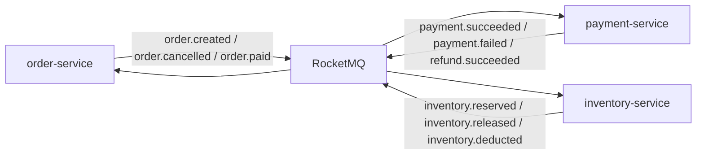
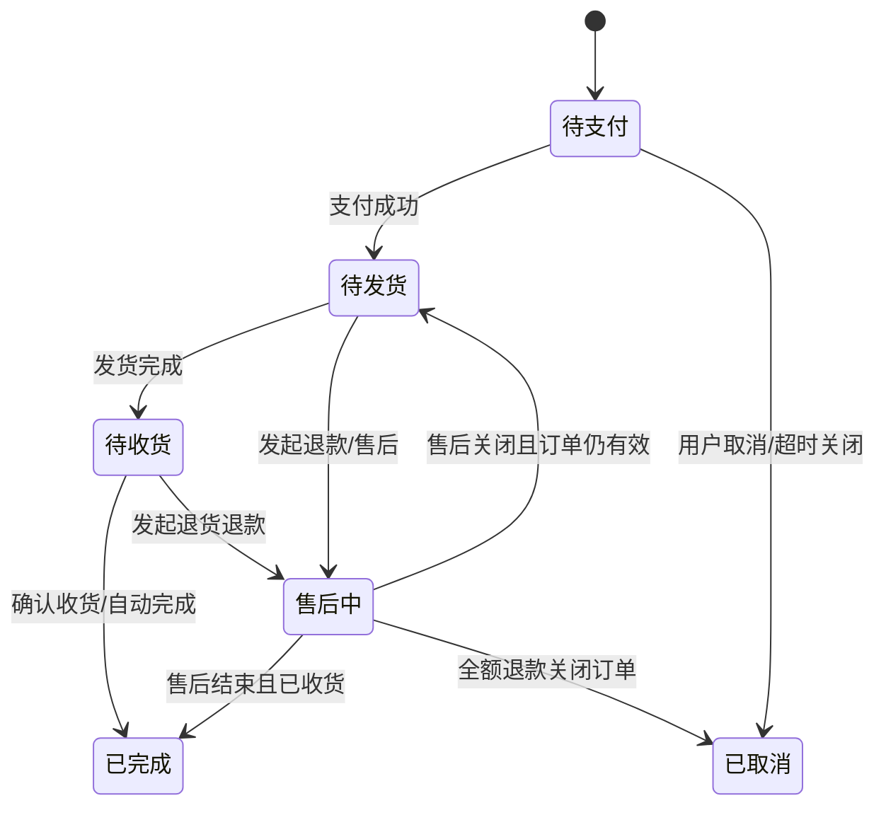
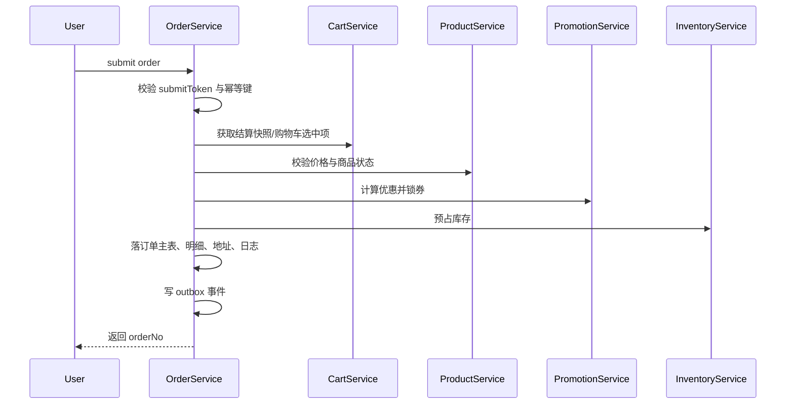
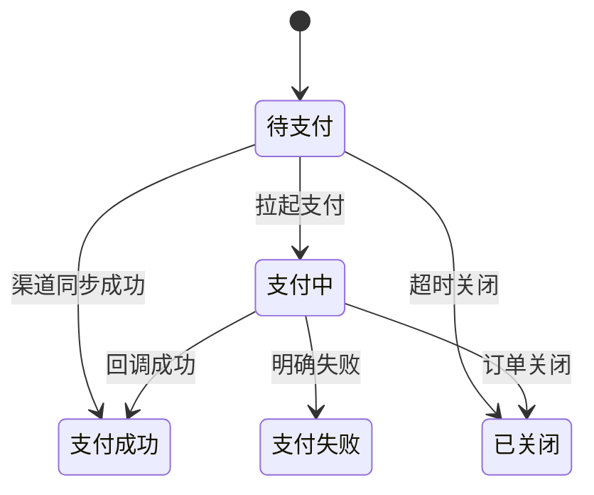
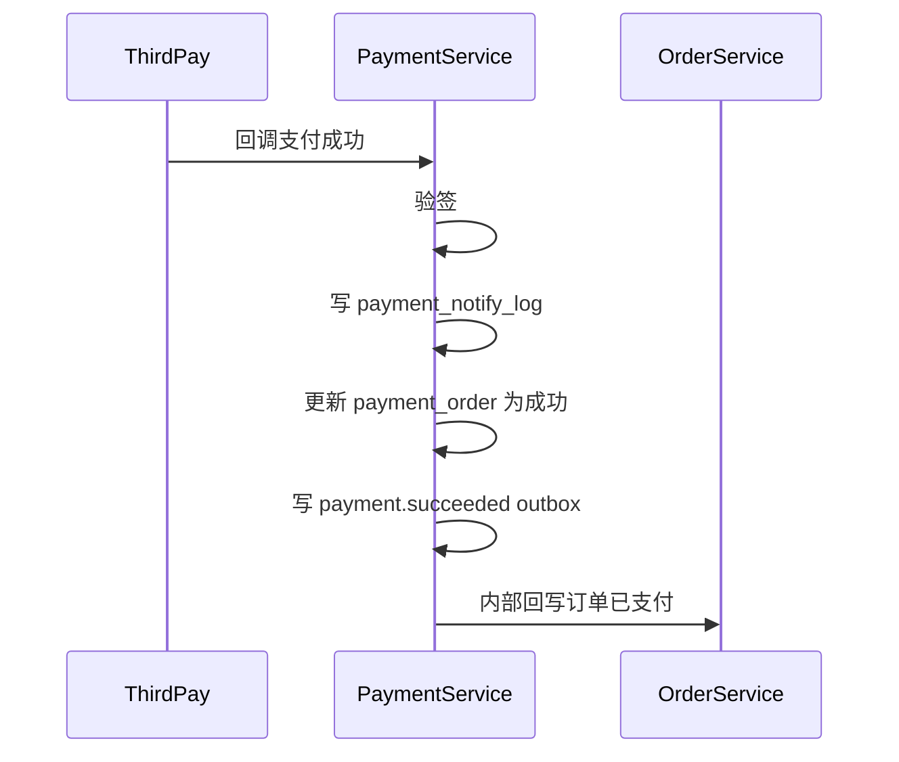
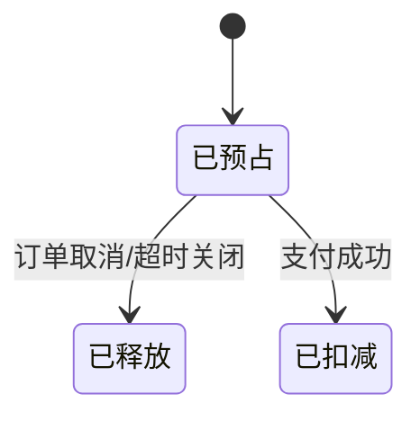
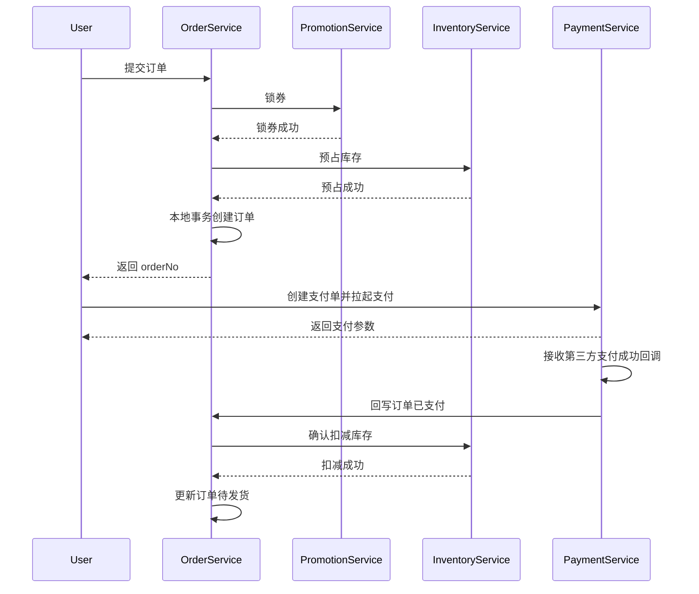
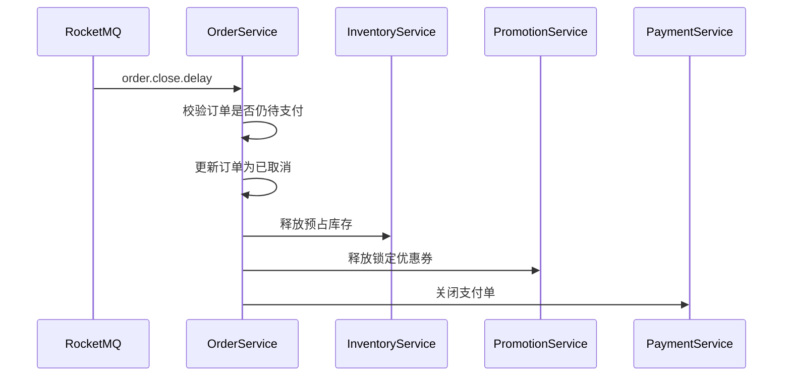
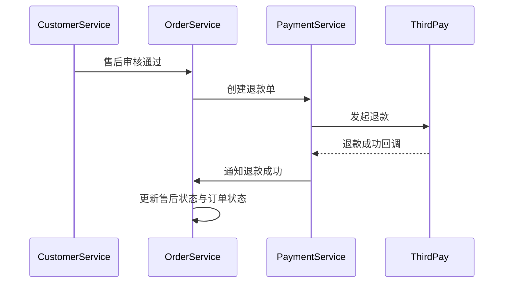

# 在线商城订单、支付、库存三大核心服务实现设计文档

## 1. 文档说明

- 文档名称：订单、支付、库存核心服务实现设计文档
- 目标读者：后端研发、架构师、测试工程师、DevOps、技术负责人
- 文档目标：从“可开发落地”的角度细化三大核心域的实现方案
- 适用范围：一期 B2C 自营商城交易主链路
- 关联文档：
  - [online-mall-microservice-development.md](D:/ideaproject/mail/docs/online-mall-microservice-development.md)
  - [online-mall-sql-schema-design.md](D:/ideaproject/mail/docs/online-mall-sql-schema-design.md)
  - [online-mall-openapi-interface-catalog.md](D:/ideaproject/mail/docs/online-mall-openapi-interface-catalog.md)
  - [online-mall-project-structure-and-maven-scaffold.md](D:/ideaproject/mail/docs/online-mall-project-structure-and-maven-scaffold.md)

## 2. 文档范围

本文件只聚焦三个最关键的服务：

1. `order-service`
2. `payment-service`
3. `inventory-service`

本文不展开的内容：

- 商品详情与搜索实现
- 营销规则引擎实现细节
- 物流轨迹对接实现
- 后台权限系统实现
- 报表离线计算实现

这些系统只会以依赖方身份出现在本设计中。

## 3. 总体设计目标

三大核心服务需要同时满足以下目标：

### 3.1 业务目标

- 支撑用户从提交订单到支付成功的完整交易闭环
- 保障库存不超卖、订单状态不乱跳、支付回调不重复入账
- 支撑订单取消、超时关闭、支付失败、退款等逆向链路

### 3.2 技术目标

- 跨服务通过可靠事件保证最终一致性
- 核心写接口具备幂等能力
- 关键链路具备补偿与人工修复手段
- 具备清晰的状态机和审计日志

### 3.3 运维目标

- 接口、MQ、数据库、缓存都有清晰监控指标
- 关键异常可以快速定位到订单号、支付单号、预占单号
- 出现一致性问题时可以通过补偿任务和人工脚本恢复

## 4. 三服务协作关系

### 4.1 领域职责边界

| 服务 | 负责内容 | 不负责内容 |
| --- | --- | --- |
| `order-service` | 下单、订单状态机、订单金额快照、售后入口 | 第三方支付对接、真实库存扣减实现 |
| `payment-service` | 支付单、退款单、支付回调、渠道适配、对账 | 订单商品明细维护、库存状态维护 |
| `inventory-service` | 库存查询、预占、释放、扣减、库存流水 | 订单金额计算、支付渠道回调 |

### 4.2 同步调用关系

- `order-service -> user-service`
- `order-service -> cart-service`
- `order-service -> product-service`
- `order-service -> promotion-service`
- `order-service -> inventory-service`
- `order-service -> payment-service`
- `payment-service -> order-service`
- `inventory-service -> product-service`

### 4.3 异步事件关系



### 4.4 统一设计约束

- 所有业务编号全局唯一：
  - `order_no`
  - `payment_no`
  - `refund_no`
  - `reserve_no`
- 所有核心写操作必须支持幂等
- 所有外部回调必须先落日志再执行业务
- 所有状态变更必须写操作日志或流水记录
- 所有 MQ 消费必须幂等，允许重复消费

## 5. 通用实现规范

## 5.1 标准分层

三个服务统一采用如下分层：

- `interfaces`：对外接口层
- `application`：应用服务层
- `domain`：领域模型与规则层
- `infrastructure`：数据库、缓存、MQ、第三方适配层

## 5.2 分布式事务策略

不采用全局 2PC，不引入强耦合分布式事务。

统一采用：

- 本地事务提交核心主数据
- 成功后发可靠事件
- 下游服务幂等消费
- 失败时通过补偿任务修正

### 5.2.1 推荐可靠事件方案

推荐使用以下任意一种方式：

1. 本地消息表 `outbox` + 定时投递
2. RocketMQ 事务消息

一期建议优先使用：

- 本地事务 + `event_outbox` 表 + 异步投递器

原因：

- 实现可控
- 排障简单
- 数据可追踪

### 5.2.2 推荐统一事件结构

```json
{
  "eventId": "evt_20260402123000001",
  "eventType": "order.created",
  "bizNo": "202604021234567890",
  "occurTime": "2026-04-02T12:30:00.123+08:00",
  "traceId": "d0f1cae8123",
  "producer": "order-service",
  "payload": {}
}
```

## 5.3 幂等设计

### 5.3.1 写接口幂等

推荐统一做法：

- 客户端提交 `Idempotency-Key`
- Redis 记录短期幂等键
- 核心表或辅助表做唯一约束兜底

### 5.3.2 MQ 消费幂等

推荐统一做法：

- `message_consume_record`
- 唯一键：`consumer_group + event_id`
- 已消费则直接返回成功

### 5.3.3 回调幂等

支付回调和退款回调统一做法：

- 根据 `third_trade_no` 或 `payment_no`
- 判断当前状态是否已经成功
- 重复回调直接返回成功应答，不重复执行业务

## 5.4 错误码规划建议

### 5.4.1 订单域

- `ORDER_SUBMIT_REPEAT`
- `ORDER_PRICE_CHANGED`
- `ORDER_STOCK_NOT_ENOUGH`
- `ORDER_COUPON_INVALID`
- `ORDER_STATUS_ILLEGAL`
- `ORDER_NOT_FOUND`

### 5.4.2 支付域

- `PAYMENT_ORDER_NOT_FOUND`
- `PAYMENT_STATUS_ILLEGAL`
- `PAYMENT_CHANNEL_UNAVAILABLE`
- `PAYMENT_NOTIFY_VERIFY_FAILED`
- `REFUND_STATUS_ILLEGAL`

### 5.4.3 库存域

- `INVENTORY_NOT_FOUND`
- `INVENTORY_NOT_ENOUGH`
- `INVENTORY_RESERVE_NOT_FOUND`
- `INVENTORY_RESERVE_EXPIRED`
- `INVENTORY_DEDUCT_REPEAT`

## 6. order-service 实现设计

数据库：`mall_order`

## 6.1 服务职责

`order-service` 负责以下能力：

- 订单确认页数据聚合
- 提交订单
- 订单状态流转
- 订单详情查询
- 用户取消订单
- 超时关单
- 确认收货
- 售后申请入口
- 订单操作日志

## 6.2 非职责范围

以下内容不在 `order-service` 内部实现：

- 第三方支付参数签名
- 支付成功真实性验证
- 实际库存扣减算法
- 优惠券规则引擎
- 运单轨迹抓取

## 6.3 订单域核心对象

### 6.3.1 聚合根

- `OrderAggregate`

### 6.3.2 实体

- `Order`
- `OrderItem`
- `OrderAddress`
- `OrderOperateLog`
- `AfterSaleOrder`

### 6.3.3 值对象

- `OrderAmount`
- `BuyerRemark`
- `OrderStatus`
- `OrderSource`
- `SubmitContext`

## 6.4 推荐包结构

```text
com.mall.order
├─ interfaces
│  ├─ rest
│  ├─ admin
│  └─ rpc
├─ application
│  ├─ service
│  ├─ command
│  ├─ query
│  ├─ dto
│  └─ assembler
├─ domain
│  ├─ model
│  ├─ service
│  ├─ repository
│  ├─ event
│  └─ factory
├─ infrastructure
│  ├─ persistence
│  ├─ feign
│  ├─ mq
│  ├─ cache
│  └─ idempotent
└─ task
```

## 6.5 数据库表与实现角色映射

| 表名 | 作用 | 读写频率 | 说明 |
| --- | --- | --- | --- |
| `order_info` | 订单主状态 | 高 | 核心主表 |
| `order_item` | 订单商品明细 | 高 | 与订单主表一对多 |
| `order_address` | 收货地址快照 | 中 | 下单后冻结 |
| `order_operate_log` | 状态变更记录 | 高 | 审计与排障核心 |
| `order_after_sale` | 售后入口记录 | 中 | 逆向流程起点 |

### 6.5.1 建议新增辅助表

为提高实现可控性，建议额外新增以下辅助表：

1. `order_submit_token`
2. `order_event_outbox`
3. `order_idempotent_record`

#### `order_submit_token`

作用：

- 防重复提交
- 结算页令牌校验

核心字段建议：

- `token`
- `user_id`
- `expire_time`
- `status`

#### `order_event_outbox`

作用：

- 记录待投递的订单事件
- 避免业务提交成功但 MQ 投递失败

核心字段建议：

- `event_id`
- `event_type`
- `biz_no`
- `payload_json`
- `send_status`
- `retry_count`
- `next_retry_time`

#### `order_idempotent_record`

作用：

- 记录外部写请求的幂等键

核心字段建议：

- `idempotency_key`
- `user_id`
- `request_hash`
- `biz_no`
- `status`

## 6.6 订单状态机设计

### 6.6.1 主状态枚举建议

| 状态码 | 状态名 | 说明 |
| --- | --- | --- |
| `10` | 待支付 | 订单创建成功，等待支付 |
| `20` | 待发货 | 已支付，等待仓库发货 |
| `30` | 待收货 | 已发货，等待用户签收 |
| `40` | 已完成 | 用户确认收货或自动完成 |
| `50` | 已取消 | 用户取消、超时取消、风控关闭 |
| `60` | 售后中 | 存在进行中的售后单 |

### 6.6.2 状态流转图



### 6.6.3 状态流转规则

- 只有 `待支付` 才允许用户主动取消
- 只有 `待支付` 才允许创建有效支付单
- 只有 `待发货` 才允许发货
- 只有 `待收货` 才允许确认收货
- 订单一旦 `已取消` 或 `已完成`，除售后数据外，不允许再走正向交易动作

## 6.7 对外接口设计要点

### 6.7.1 用户端核心接口

- `GET /api/v1/orders/confirm`
- `POST /api/v1/orders/submit`
- `GET /api/v1/orders`
- `GET /api/v1/orders/{orderNo}`
- `POST /api/v1/orders/{orderNo}/cancel`
- `POST /api/v1/orders/{orderNo}/confirm-receipt`

### 6.7.2 后台端核心接口

- `GET /admin-api/v1/orders`
- `GET /admin-api/v1/orders/{orderNo}`
- `POST /admin-api/v1/orders/{orderNo}/close`
- `POST /admin-api/v1/orders/{orderNo}/remark`

### 6.7.3 内部接口

- `POST /internal/v1/orders/{orderNo}/paid`
- `POST /internal/v1/orders/{orderNo}/cancel-timeout`
- `POST /internal/v1/orders/{orderNo}/delivery-status`
- `GET /internal/v1/orders/{orderNo}`

## 6.8 订单确认页实现

### 6.8.1 输入

- `userId`
- `settlementToken`

### 6.8.2 需要聚合的数据

- 用户默认地址
- 购物车选中商品
- SKU 最新价格
- SKU 最新库存状态
- 可用优惠券
- 运费试算
- 最终应付金额

### 6.8.3 实现建议

- 由 `OrderConfirmApplicationService` 负责聚合
- 调用下游服务时使用并行聚合模式
- 返回值中带 `confirmToken` 或 `submitToken`
- 同时落一份短期结算快照到 Redis 或 `cart_settlement_snapshot`

### 6.8.4 失败处理

- 任一下游服务失败时，返回可读错误信息
- 若商品已失效、库存不足、价格变化，要明确返回变化明细

## 6.9 提交订单实现设计

### 6.9.1 输入参数

- `submitToken`
- `addressId`
- `selectedSkuItems`
- `couponIds?`
- `buyerRemark`
- `sourceType`

### 6.9.2 提交订单时序



### 6.9.3 提交订单事务边界

订单服务本地事务内只做以下事：

1. 校验幂等
2. 校验提交令牌
3. 保存订单主数据
4. 保存订单操作日志
5. 保存待发送事件

以下操作建议放在本地事务外，但要求成功后才能继续落单：

- 锁优惠券
- 预占库存

因此整体顺序建议为：

1. 校验幂等和令牌
2. 查询快照并二次校验价格
3. 调营销服务锁券
4. 调库存服务预占库存
5. 本地事务落订单
6. 本地事务落 outbox
7. 异步发送 `order.created`

### 6.9.4 为什么先锁券和锁库存再落单

原因：

- 避免落单成功后才发现券或库存无法锁定
- 订单主数据可以认为是在外部资源已准备好的前提下最终提交

风险：

- 若锁券或锁库存成功，但订单本地事务失败，需要补偿释放

补偿方式：

- 订单本地事务失败时立即同步释放
- 若同步释放失败，写补偿任务重试

### 6.9.5 核心应用服务建议

- `OrderConfirmApplicationService`
- `OrderSubmitApplicationService`
- `OrderCancelApplicationService`
- `OrderPayApplicationService`
- `OrderQueryApplicationService`
- `AfterSaleApplicationService`

### 6.9.6 关键领域服务建议

- `OrderAmountDomainService`
- `OrderStatusDomainService`
- `OrderValidatorDomainService`
- `OrderExpireDomainService`

### 6.9.7 提交订单伪代码

```java
public OrderSubmitResult submit(OrderSubmitCommand command) {
    idempotentChecker.check(command.getIdempotencyKey(), command.getUserId());
    submitTokenManager.consume(command.getSubmitToken(), command.getUserId());

    SettlementSnapshot snapshot = settlementService.getValidSnapshot(command);
    productValidator.check(snapshot);

    PromotionLockResult promotionLock = promotionClient.lockCoupons(...);
    StockReserveResult stockReserve = inventoryClient.reserve(...);

    try {
        return transactionTemplate.execute(status -> {
            OrderAggregate aggregate = orderFactory.create(snapshot, promotionLock, stockReserve, command);
            orderRepository.save(aggregate);
            orderOperateLogRepository.saveCreatedLog(aggregate);
            outboxRepository.save(OrderCreatedEvent.from(aggregate));
            return OrderSubmitResult.of(aggregate.getOrderNo());
        });
    } catch (Exception ex) {
        compensationService.releasePromotionAndStock(promotionLock, stockReserve);
        throw ex;
    }
}
```

## 6.10 订单取消实现

### 6.10.1 取消场景

- 用户主动取消
- 系统超时取消
- 后台风控关闭

### 6.10.2 取消原则

- 只有 `待支付` 状态允许整单取消
- 已支付订单不能走普通取消，只能走退款/售后

### 6.10.3 本地事务内动作

1. 校验当前状态
2. 更新 `order_info.status = 已取消`
3. 写 `order_operate_log`
4. 写 `order.cancelled` 到 outbox

### 6.10.4 异步后置动作

- 释放库存
- 释放优惠券
- 通知用户

## 6.11 超时关单设计

### 6.11.1 超时策略

建议统一：

- 正常订单：30 分钟未支付自动关闭
- 秒杀订单：5 分钟未支付自动关闭

### 6.11.2 实现方案

推荐两种方式：

1. RocketMQ 延迟消息
2. 定时扫描任务

一期建议：

- 主方案：RocketMQ 延迟消息
- 兜底方案：定时扫描任务补偿

### 6.11.3 延迟消息内容

- `orderNo`
- `expireTime`
- `orderType`
- `traceId`

### 6.11.4 消费逻辑

- 取到消息后先查订单当前状态
- 若状态不是 `待支付`，直接忽略
- 若仍为 `待支付`，执行取消逻辑

## 6.12 支付成功回写设计

### 6.12.1 输入

来自 `payment-service` 的内部请求或 `payment.succeeded` 事件：

- `paymentNo`
- `orderNo`
- `payChannel`
- `payAmount`
- `thirdTradeNo`
- `payTime`

### 6.12.2 本地事务动作

1. 校验订单存在
2. 校验订单当前状态是 `待支付`
3. 校验金额一致
4. 更新为 `待发货`
5. 更新支付状态
6. 写操作日志
7. 写 `order.paid` 事件到 outbox

### 6.12.3 幂等规则

- 若订单已是 `待发货` 且支付状态为成功，直接返回成功
- 若金额不一致，写异常记录并人工告警，不自动修改金额

## 6.13 订单查询设计

### 6.13.1 查询场景

- 用户订单列表
- 用户订单详情
- 后台订单详情
- 支付结果页轮询

### 6.13.2 查询策略

- 用户端列表优先查 `order_info` + `order_item` 简化视图
- 详情页再补地址、日志、支付、物流聚合信息
- 对热点订单详情可以做 Redis 短缓存，TTL 建议 1 到 5 分钟

### 6.13.3 不建议做法

- 每次详情查询都串行调用全部下游服务
- 订单列表页返回过深结构

## 6.14 售后入口设计

### 6.14.1 订单域内只做什么

- 接收售后申请
- 校验售后资格
- 生成 `order_after_sale`
- 更新订单售后状态

### 6.14.2 不做什么

- 不直接对接支付渠道退款
- 不直接处理物流退货入库

### 6.14.3 推荐后续演进

- 一期作为订单域子模块
- 二期可演进为独立 `after-sale-service`

## 6.15 订单域 MQ 设计

### 6.15.1 生产事件

- `order.created`
- `order.cancelled`
- `order.timeout.cancelled`
- `order.paid`
- `order.shipped`
- `order.finished`
- `after_sale.created`

### 6.15.2 消费事件

- `payment.succeeded`
- `payment.failed`
- `refund.succeeded`
- `shipment.delivered`

### 6.15.3 Topic 建议

- Topic：`order-event`
- Tag：
  - `CREATED`
  - `CANCELLED`
  - `PAID`
  - `FINISHED`
  - `AFTER_SALE_CREATED`

## 6.16 订单域缓存设计

### 6.16.1 适合缓存的数据

- 确认页结算快照
- 防重复提交令牌
- 热点订单详情短缓存

### 6.16.2 不建议缓存的数据

- 订单最终状态的唯一真相
- 支付成功判定结果

## 6.17 订单域监控指标

- `order_submit_qps`
- `order_submit_success_rate`
- `order_timeout_close_count`
- `order_cancel_count`
- `order_paid_delay_ms`
- `order_outbox_pending_count`

## 6.18 订单域重点测试

### 6.18.1 单元测试

- 金额分摊
- 状态流转合法性
- 幂等校验

### 6.18.2 集成测试

- 锁券成功、锁库存成功、落单成功
- 锁券成功、锁库存成功、落单失败补偿释放
- 支付成功回写幂等
- 超时关单重复消费幂等

### 6.18.3 端到端测试

- 正常下单支付成功
- 下单后超时取消
- 提交订单时库存不足
- 提交订单时优惠券失效

## 7. payment-service 实现设计

数据库：`mall_payment`

## 7.1 服务职责

`payment-service` 负责以下能力：

- 创建支付单
- 聚合支付渠道参数
- 接收第三方支付回调
- 创建退款单
- 接收第三方退款回调
- 支付对账
- 支付单状态查询

## 7.2 非职责范围

以下内容不由 `payment-service` 决定：

- 订单是否允许支付，由订单状态决定
- 订单是否允许退款，由售后审批结果决定
- 库存是否扣减，由库存服务决定

## 7.3 支付域核心对象

### 7.3.1 聚合根

- `PaymentOrderAggregate`
- `RefundOrderAggregate`

### 7.3.2 实体

- `PaymentOrder`
- `PaymentNotifyLog`
- `RefundOrder`
- `PaymentReconcileBill`

### 7.3.3 值对象

- `PayChannel`
- `PaymentStatus`
- `RefundStatus`
- `MoneyAmount`
- `NotifyPayload`

## 7.4 推荐包结构

```text
com.mall.payment
├─ interfaces
│  ├─ rest
│  ├─ admin
│  ├─ rpc
│  └─ callback
├─ application
│  ├─ service
│  ├─ dto
│  ├─ command
│  └─ assembler
├─ domain
│  ├─ model
│  ├─ service
│  ├─ gateway
│  ├─ repository
│  └─ factory
├─ infrastructure
│  ├─ persistence
│  ├─ mq
│  ├─ channel
│  │  ├─ alipay
│  │  ├─ wechat
│  │  └─ mock
│  ├─ config
│  └─ lock
└─ task
```

## 7.5 数据库表与实现角色映射

| 表名 | 作用 | 读写频率 | 说明 |
| --- | --- | --- | --- |
| `payment_order` | 支付主单 | 高 | 支付核心主表 |
| `payment_notify_log` | 回调原始日志 | 高 | 回调审计、排障核心 |
| `refund_order` | 退款单 | 中 | 逆向支付流程核心 |
| `payment_reconcile_bill` | 对账单 | 低 | 财务对账 |

### 7.5.1 建议新增辅助表

建议新增：

1. `payment_event_outbox`
2. `payment_idempotent_record`
3. `payment_channel_config`
4. `payment_reconcile_diff`

#### `payment_event_outbox`

作用：

- 持久化 `payment.succeeded`、`payment.failed`、`refund.succeeded` 等事件

#### `payment_idempotent_record`

作用：

- 记录创建支付单、创建退款单时的幂等键

#### `payment_channel_config`

作用：

- 存储渠道开关、商户号、证书路径、回调地址等配置

#### `payment_reconcile_diff`

作用：

- 对账差异记录，便于人工核对和补偿

## 7.6 支付状态机设计

### 7.6.1 支付单状态

| 状态码 | 状态名 | 说明 |
| --- | --- | --- |
| `0` | 待支付 | 支付单创建成功 |
| `1` | 支付中 | 已拉起支付或轮询中 |
| `2` | 支付成功 | 第三方确认成功 |
| `3` | 支付失败 | 明确失败 |
| `4` | 已关闭 | 超时或订单关闭 |

### 7.6.2 退款单状态

| 状态码 | 状态名 | 说明 |
| --- | --- | --- |
| `0` | 待退款 | 退款单创建成功 |
| `1` | 退款中 | 已提交渠道 |
| `2` | 退款成功 | 渠道确认成功 |
| `3` | 退款失败 | 渠道确认失败 |

### 7.6.3 状态流转图



## 7.7 支付渠道抽象设计

### 7.7.1 统一网关接口

建议定义：

```java
public interface PayChannelGateway {
    PaymentCreateResult create(PaymentCreateCommand command);
    PaymentQueryResult query(String paymentNo);
    PaymentNotifyResult verifyAndParse(PaymentNotifyRequest request);
    RefundCreateResult refund(RefundCreateCommand command);
    RefundNotifyResult verifyRefundNotify(RefundNotifyRequest request);
    ReconcileDownloadResult downloadBill(ReconcileDownloadCommand command);
}
```

### 7.7.2 渠道实现

- `AlipayGateway`
- `WechatPayGateway`
- `MockPayGateway`

### 7.7.3 工厂模式

建议使用：

- `PayChannelGatewayFactory`

职责：

- 根据 `payChannel` 选择具体实现
- 对上层屏蔽渠道差异

## 7.8 创建支付单实现

### 7.8.1 前置校验

- 校验订单存在
- 校验订单状态为 `待支付`
- 校验订单金额和支付金额一致
- 校验当前订单没有未关闭的有效支付单

### 7.8.2 推荐处理流程

1. 接收 `orderNo`、`payChannel`、`payerId`
2. 查询订单基础信息
3. 校验支付资格
4. 本地事务创建 `payment_order`
5. 调用支付渠道生成支付参数
6. 更新支付单状态为 `支付中` 或保留 `待支付`
7. 返回前端支付参数

### 7.8.3 幂等规则

- 同一订单、同一支付渠道、同一未过期支付单可复用
- 若已存在成功支付单，直接返回成功状态，不新建

## 7.9 支付回调处理实现

### 7.9.1 核心原则

- 先验签
- 再落回调日志
- 再执行业务
- 全程幂等

### 7.9.2 处理流程



### 7.9.3 本地事务动作

1. 查询支付单
2. 判断当前状态是否已成功
3. 更新支付单状态为成功
4. 保存回调日志处理结果
5. 写 `payment.succeeded` 到 outbox

### 7.9.4 状态幂等规则

- 若支付单已成功，则重复回调直接返回成功
- 若支付单已关闭但渠道回调成功，进入异常单处理流程并人工告警

### 7.9.5 金额校验

必须校验：

- 渠道回调金额
- 本地支付单金额
- 订单金额

若不一致：

- 不自动改金额
- 标记为异常
- 发告警
- 进入人工核对

## 7.10 退款实现

### 7.10.1 退款入口

退款入口只接受内部调用：

- 售后审核通过
- 后台人工退款

### 7.10.2 退款流程

1. 校验原支付单状态为成功
2. 校验累计退款金额不超过原支付金额
3. 本地事务创建 `refund_order`
4. 调用支付渠道发起退款
5. 更新退款单状态为 `退款中`
6. 等待退款回调

### 7.10.3 退款成功处理

- 更新退款单为成功
- 写 `refund.succeeded` 事件到 outbox
- 推动订单售后流转

## 7.11 关闭支付单设计

### 7.11.1 关闭场景

- 订单取消
- 超时未支付
- 前端主动放弃支付

### 7.11.2 实现原则

- 关闭支付单必须先判断是否已支付成功
- 对已成功支付单不能再关闭

### 7.11.3 调用时机

- `order.cancelled` 事件消费后
- 定时任务扫描已过期支付单

## 7.12 对账设计

### 7.12.1 对账目标

- 找出第三方成功但本地失败
- 找出本地成功但第三方失败
- 找出金额不一致

### 7.12.2 对账流程

1. 定时下载渠道账单
2. 解析账单
3. 与本地支付单做差异比对
4. 生成差异表
5. 自动修复或人工介入

### 7.12.3 自动修复建议

可自动修复的场景：

- 渠道成功、本地待支付，且金额一致

不建议自动修复的场景：

- 金额不一致
- 渠道失败、本地成功

## 7.13 支付域 MQ 设计

### 7.13.1 生产事件

- `payment.created`
- `payment.succeeded`
- `payment.failed`
- `payment.closed`
- `refund.created`
- `refund.succeeded`
- `refund.failed`

### 7.13.2 消费事件

- `order.created`
- `order.cancelled`
- `after_sale.created`
- `after_sale.approved`

### 7.13.3 Topic 建议

- Topic：`payment-event`
- Tag：
  - `PAY_SUCCEEDED`
  - `PAY_FAILED`
  - `PAY_CLOSED`
  - `REFUND_SUCCEEDED`
  - `REFUND_FAILED`

## 7.14 支付域安全设计

### 7.14.1 必须做到

- 所有回调验签
- 敏感参数脱敏日志
- 退款接口只允许内部或后台高权限角色调用
- 渠道私钥证书不放代码仓库

### 7.14.2 日志注意事项

不打印：

- 完整签名串
- 私钥
- 证书原文
- 用户完整实名信息

## 7.15 支付域监控指标

- `payment_create_count`
- `payment_success_rate`
- `payment_notify_repeat_count`
- `payment_notify_verify_fail_count`
- `refund_success_rate`
- `reconcile_diff_count`

## 7.16 支付域重点测试

### 7.16.1 单元测试

- 状态机合法性
- 渠道工厂分发
- 回调验签处理

### 7.16.2 集成测试

- 创建支付单幂等
- 支付成功回调幂等
- 退款成功回调幂等
- 订单取消后支付单关闭

### 7.16.3 沙箱测试

- 支付宝沙箱支付成功
- 微信沙箱支付成功
- 退款成功回调
- 回调验签失败

## 8. inventory-service 实现设计

数据库：`mall_inventory`

## 8.1 服务职责

`inventory-service` 负责以下能力：

- 查询可售库存
- 预占库存
- 释放预占库存
- 正式扣减库存
- 库存调整
- 库存流水记录
- 库存预警

## 8.2 非职责范围

以下内容不属于库存服务：

- 商品价格和营销信息
- 订单状态判断
- 支付真实性校验

## 8.3 库存域核心对象

### 8.3.1 聚合根

- `StockAggregate`
- `ReservationAggregate`

### 8.3.2 实体

- `Stock`
- `Reservation`
- `InventoryRecord`
- `Warehouse`

### 8.3.3 值对象

- `StockChangeType`
- `StockCheckResult`
- `WarehouseSelectResult`

## 8.4 推荐包结构

```text
com.mall.inventory
├─ interfaces
│  ├─ rest
│  ├─ admin
│  └─ rpc
├─ application
│  ├─ service
│  ├─ dto
│  ├─ command
│  └─ assembler
├─ domain
│  ├─ model
│  ├─ service
│  ├─ allocator
│  ├─ repository
│  └─ factory
├─ infrastructure
│  ├─ persistence
│  ├─ mq
│  ├─ cache
│  └─ lock
└─ task
```

## 8.5 数据库表与实现角色映射

| 表名 | 作用 | 读写频率 | 说明 |
| --- | --- | --- | --- |
| `inventory_warehouse` | 仓库主表 | 低 | 仓库配置 |
| `inventory_stock` | 库存余额表 | 极高 | 并发核心 |
| `inventory_reservation` | 预占记录表 | 高 | 防超卖关键 |
| `inventory_record` | 库存流水表 | 高 | 审计与对账 |

### 8.5.1 建议新增辅助表

建议新增：

1. `inventory_event_outbox`
2. `inventory_idempotent_record`
3. `inventory_low_stock_task`

#### `inventory_event_outbox`

作用：

- 保存 `inventory.reserved`、`inventory.released`、`inventory.deducted`

#### `inventory_idempotent_record`

作用：

- 防止 `reserve`、`release`、`deduct` 重复执行

#### `inventory_low_stock_task`

作用：

- 记录低库存告警任务，避免重复告警刷屏

## 8.6 库存与预占状态定义

### 8.6.1 库存余额定义

- `available_qty`：物理可用库存
- `locked_qty`：已锁未扣库存
- `saleable_qty`：可售库存

建议关系：

```text
saleable_qty = available_qty - locked_qty
```

### 8.6.2 预占状态

| 状态码 | 状态名 | 说明 |
| --- | --- | --- |
| `1` | 已预占 | 下单成功但未支付 |
| `2` | 已释放 | 订单取消或超时关闭 |
| `3` | 已扣减 | 支付成功后确认扣减 |

### 8.6.3 状态流转图



## 8.7 仓库选择策略

一期建议简单实现：

- 单仓或默认仓优先

若需要多仓：

- 优先同城仓
- 其次主仓
- 兜底按库存充足度排序

推荐抽象接口：

```java
public interface WarehouseAllocator {
    WarehouseSelectResult allocate(Long skuId, Integer qty, AddressSnapshot address);
}
```

## 8.8 并发控制策略

库存服务是三大核心服务里并发冲突最明显的服务。

### 8.8.1 推荐方案

- 数据库条件更新 + 乐观锁版本号
- 关键场景加 Redis 分布式锁作为补充，而不是主策略

### 8.8.2 预占 SQL 思路

```sql
UPDATE inventory_stock
SET locked_qty = locked_qty + #{qty},
    saleable_qty = saleable_qty - #{qty},
    version = version + 1
WHERE sku_id = #{skuId}
  AND warehouse_id = #{warehouseId}
  AND saleable_qty >= #{qty}
  AND version = #{version};
```

### 8.8.3 为什么不直接用悲观锁

- 高并发下吞吐差
- 容易放大锁等待
- 秒杀场景风险更高

## 8.9 预占库存实现

### 8.9.1 输入

- `orderNo`
- `skuItems`
- `expireTime`

### 8.9.2 流程

1. 幂等检查：是否已存在该订单的有效预占记录
2. 为每个 SKU 选择仓库
3. 执行库存条件更新
4. 插入 `inventory_reservation`
5. 插入 `inventory_record`
6. 写 `inventory.reserved` 到 outbox

### 8.9.3 批量预占原则

- 订单级要么全部成功，要么全部失败
- 任一 SKU 失败时，对之前已成功预占的 SKU 做回滚释放

### 8.9.4 推荐应用服务

- `StockCheckApplicationService`
- `StockReserveApplicationService`
- `StockReleaseApplicationService`
- `StockDeductApplicationService`
- `StockAdjustApplicationService`

## 8.10 释放库存实现

### 8.10.1 触发场景

- 订单取消
- 超时关单
- 订单创建失败补偿

### 8.10.2 实现流程

1. 根据 `orderNo` 查预占记录
2. 过滤状态为 `已预占`
3. 批量执行回滚：
   - `locked_qty - qty`
   - `saleable_qty + qty`
4. 更新预占状态为 `已释放`
5. 写库存流水
6. 写 `inventory.released`

### 8.10.3 幂等规则

- 若预占记录已是 `已释放`，直接返回成功
- 若预占记录已是 `已扣减`，拒绝释放并告警

## 8.11 确认扣减库存实现

### 8.11.1 触发场景

- 支付成功

### 8.11.2 实现原则

确认扣减并不是再次减少 `saleable_qty`，因为预占阶段已经减少可售库存。

扣减阶段建议执行：

- `available_qty = available_qty - qty`
- `locked_qty = locked_qty - qty`

### 8.11.3 实现流程

1. 根据 `orderNo` 查预占记录
2. 过滤状态为 `已预占`
3. 更新库存余额
4. 更新预占状态为 `已扣减`
5. 写库存流水
6. 写 `inventory.deducted`

### 8.11.4 幂等规则

- 若已是 `已扣减`，直接返回成功
- 若已是 `已释放`，说明发生顺序异常，需告警处理

## 8.12 库存校验接口实现

### 8.12.1 用途

- 商品详情展示
- 结算页库存校验
- 秒杀资格校验

### 8.12.2 返回建议

返回不只要有 `enough / not enough`，还应返回：

- `saleableQty`
- `warehouseId`
- `reasonCode`

## 8.13 库存调整设计

### 8.13.1 调整场景

- 人工盘点
- 入库
- 报损
- 补货
- 系统修正

### 8.13.2 实现原则

- 只允许后台高权限操作
- 必须记录操作人和原因
- 必须写 `inventory_record`

## 8.14 库存预警设计

### 8.14.1 触发条件

- `saleable_qty <= warning_qty`

### 8.14.2 处理方式

- 写低库存告警表
- 发送通知给运营或仓储负责人

## 8.15 库存域 MQ 设计

### 8.15.1 生产事件

- `inventory.reserved`
- `inventory.reserve.failed`
- `inventory.released`
- `inventory.deducted`
- `inventory.low.warning`

### 8.15.2 消费事件

- `order.cancelled`
- `order.timeout.cancelled`
- `order.paid`

### 8.15.3 Topic 建议

- Topic：`inventory-event`
- Tag：
  - `RESERVED`
  - `RELEASED`
  - `DEDUCTED`
  - `LOW_WARNING`

## 8.16 库存缓存设计

### 8.16.1 适合缓存的数据

- 商品详情页库存展示值
- 热点 SKU 的可售库存快照

### 8.16.2 注意事项

- 缓存只能做展示加速
- 下单时一定以数据库最新值为准

### 8.16.3 秒杀场景预留

后续秒杀可以扩展：

- Redis 预减库存
- 异步批量落库
- 排队令牌机制

但一期普通商城不建议先做过度复杂化。

## 8.17 库存域监控指标

- `inventory_reserve_qps`
- `inventory_reserve_fail_rate`
- `inventory_release_count`
- `inventory_deduct_count`
- `inventory_low_warning_count`
- `inventory_reservation_pending_count`

## 8.18 库存域重点测试

### 8.18.1 单元测试

- 预占状态机
- 可售库存计算
- 扣减与释放规则

### 8.18.2 并发测试

- 并发 100/500/1000 下单预占
- 验证无超卖
- 验证最终余额正确

### 8.18.3 集成测试

- 预占成功后支付成功扣减
- 预占成功后超时取消释放
- 扣减和释放重复请求幂等

## 9. 三服务跨域关键流程设计

## 9.1 正常下单到支付成功流程



### 9.1.1 关键一致性点

- 订单提交成功前，库存和优惠券必须已锁定
- 支付成功后，订单状态更新与库存确认扣减必须保证可补偿
- 支付服务不直接改库存
- 库存服务不直接改订单金额或支付状态

## 9.2 超时关单流程



### 9.2.1 超时流程的幂等要求

- 延迟消息重复投递不能重复取消订单
- 释放库存重复执行必须安全
- 支付单关闭重复执行必须安全

## 9.3 支付回调晚于关单的处理

这是交易系统最容易出现争议的场景之一。

### 9.3.1 场景描述

- 订单已被系统超时关闭
- 第三方支付成功回调晚到

### 9.3.2 推荐处理策略

优先推荐：

- 一旦订单已取消，不自动恢复订单
- 将该支付记录标记为异常支付
- 触发退款或人工处理流程

### 9.3.3 为什么不自动恢复订单

- 库存可能已释放并被其他订单占用
- 优惠券可能已释放并被再次使用
- 自动恢复会把一致性问题放大

## 9.4 退款流程



### 9.4.1 一期建议

- 退款成功不自动回补商品库存
- 若业务需要回补库存，应由售后确认收到退货后再执行

## 10. 补偿与修复机制设计

## 10.1 补偿原则

- 所有跨服务动作默认认为可能失败
- 所有关键状态都要有“查、补、修”的手段
- 先保证数据可见，再考虑自动补偿

## 10.2 建议补偿任务

### 10.2.1 订单域

- `OrderOutboxResendJob`
- `OrderTimeoutScanJob`
- `OrderPaidButStockNotDeductedRepairJob`

### 10.2.2 支付域

- `PaymentOutboxResendJob`
- `ExpiredPaymentCloseJob`
- `PaymentReconcileRepairJob`

### 10.2.3 库存域

- `InventoryOutboxResendJob`
- `ExpiredReservationReleaseJob`
- `InventoryBalanceCheckJob`

## 10.3 常见异常与修复策略

| 异常场景 | 可能原因 | 修复策略 |
| --- | --- | --- |
| 订单存在但无支付单 | 创建支付单失败 | 用户重试创建支付单 |
| 支付成功但订单未更新 | 回调后内部调用失败 | 支付事件补偿重放 |
| 订单已取消但库存未释放 | 释放库存失败 | 扫描 `order.cancelled` 未释放单补偿 |
| 库存已扣减但订单仍待支付 | 顺序异常或人工误操作 | 人工核查后修复订单状态 |
| 渠道成功、本地支付失败 | 回调丢失或处理失败 | 对账修复 |
| 支付金额不一致 | 回调异常或风控风险 | 冻结订单并人工介入 |

## 10.4 推荐人工排障入口

建议后台增加“交易修复工具”：

- 按 `orderNo` 查询订单、支付、库存预占、库存流水
- 手工重发事件
- 手工释放库存
- 手工同步支付状态
- 手工标记异常完成

## 11. 关键类设计建议

## 11.1 order-service

推荐核心类：

- `OrderSubmitApplicationService`
- `OrderStatusDomainService`
- `OrderFactory`
- `OrderRepository`
- `OrderOutboxPublisher`
- `OrderTimeoutConsumer`
- `PaymentSucceedConsumer`

## 11.2 payment-service

推荐核心类：

- `PaymentCreateApplicationService`
- `PaymentNotifyApplicationService`
- `RefundApplicationService`
- `PayChannelGatewayFactory`
- `PaymentRepository`
- `RefundRepository`
- `PaymentOutboxPublisher`

## 11.3 inventory-service

推荐核心类：

- `StockReserveApplicationService`
- `StockReleaseApplicationService`
- `StockDeductApplicationService`
- `WarehouseAllocator`
- `StockRepository`
- `ReservationRepository`
- `InventoryOutboxPublisher`

## 12. 配置项设计建议

建议将以下配置放入 Nacos：

### 12.1 订单服务配置

- `order.timeout.normal-minutes`
- `order.timeout.flash-sale-minutes`
- `order.submit.idempotent.ttl-seconds`
- `order.confirm.cache.ttl-seconds`

### 12.2 支付服务配置

- `payment.default-expire-minutes`
- `payment.callback.allowed-ip-list`
- `payment.reconcile.enable`
- `payment.refund.async-timeout-seconds`

### 12.3 库存服务配置

- `inventory.reserve.expire-minutes`
- `inventory.warning.default-threshold`
- `inventory.low-stock.notify.enable`
- `inventory.check.cache.ttl-seconds`

## 13. 日志与链路追踪设计

## 13.1 关键日志字段

三个服务日志统一打印：

- `traceId`
- `userId`
- `orderNo`
- `paymentNo`
- `refundNo`
- `reserveNo`
- `skuId`
- `eventId`

## 13.2 审计日志重点

### 13.2.1 订单服务

- 创建订单
- 取消订单
- 支付状态变更
- 售后申请

### 13.2.2 支付服务

- 创建支付单
- 回调验签结果
- 支付状态变更
- 创建退款单

### 13.2.3 库存服务

- 预占库存
- 释放库存
- 扣减库存
- 手工调整库存

## 14. 监控与告警设计

## 14.1 必设告警

### 14.1.1 订单域

- 订单提交失败率过高
- 待发送 outbox 积压过多
- 超时关单任务失败

### 14.1.2 支付域

- 回调验签失败数突增
- 支付成功率明显下降
- 对账差异数增加

### 14.1.3 库存域

- 预占失败率突增
- 低库存 SKU 数过多
- 释放库存失败

## 14.2 Dashboard 建议

建议单独做“交易核心链路大盘”，包含：

- 订单提交成功率
- 平均下单耗时
- 支付成功率
- 平均支付确认延迟
- 库存预占成功率
- 超时关单数
- 异常支付数
- 待补偿任务数

## 15. 测试方案补充

## 15.1 三服务联调用例

必须覆盖以下主路径：

1. 正常下单 -> 支付成功 -> 扣减库存 -> 待发货
2. 正常下单 -> 超时关闭 -> 释放库存
3. 创建支付单重复请求 -> 只生成一个有效支付单
4. 支付成功重复回调 -> 订单只更新一次
5. 库存释放重复请求 -> 最终库存正确
6. 退款成功 -> 售后状态更新

## 15.2 故障注入测试

建议做故障注入：

- 订单落库成功但发送 MQ 失败
- 支付回调日志落库成功但回写订单失败
- 订单取消成功但释放库存失败
- 预占部分 SKU 成功，部分 SKU 失败

## 15.3 性能测试重点

### 15.3.1 订单服务

- 提交订单接口
- 订单详情接口

### 15.3.2 支付服务

- 创建支付单接口
- 回调处理接口

### 15.3.3 库存服务

- 批量校验库存接口
- 预占库存接口
- 确认扣减接口

## 16. 开发落地建议

## 16.1 第一批必须完成

1. 三服务基础脚手架
2. 主表和辅助表
3. 核心写接口
4. 状态机与幂等框架
5. outbox 投递器
6. MQ 消费幂等组件

## 16.2 第二批补齐

1. 对账任务
2. 修复任务
3. 低库存告警
4. 后台修复工具
5. 更完整的监控面板

## 16.3 推荐研发拆分方式

可按下面方式拆分任务：

- A 组：`order-service`
  - 订单确认页
  - 提交订单
  - 状态机
  - 超时关单
- B 组：`payment-service`
  - 创建支付单
  - 回调处理
  - 退款处理
  - 对账
- C 组：`inventory-service`
  - 库存查询
  - 预占释放扣减
  - 库存流水
  - 告警
- D 组：联调与补偿
  - MQ 事件
  - outbox
  - 补偿任务
  - 压测与监控

## 17. 最终建议

这三个服务是整个商城系统最关键的交易核心。真正落地时，最重要的不是接口数量，而是下面四件事做扎实：

1. 状态机清晰，禁止非法流转
2. 幂等做透，允许重复请求和重复消息
3. 补偿链完整，出现异常时能恢复
4. 监控和日志足够清晰，排障时能快速定位

如果继续深化，下一步最值得直接补的是：

1. 三个服务的“详细类图与包图”
2. 三个服务的“事件消息体 JSON 示例”
3. 三个服务的“可直接执行的开发任务拆解清单”
